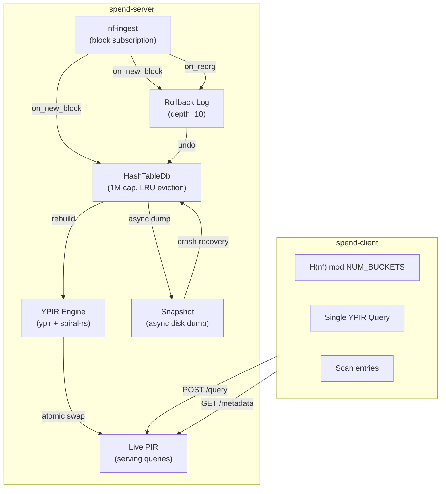
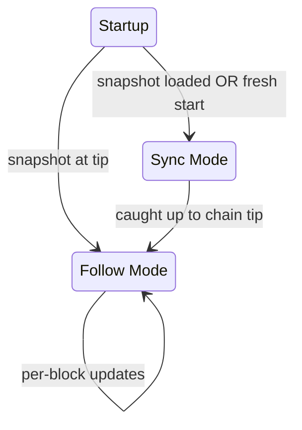
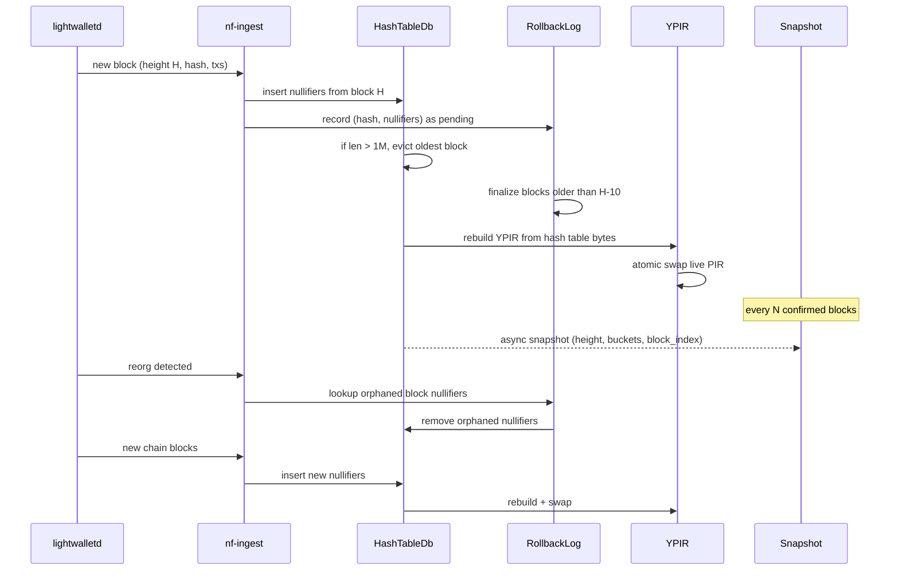
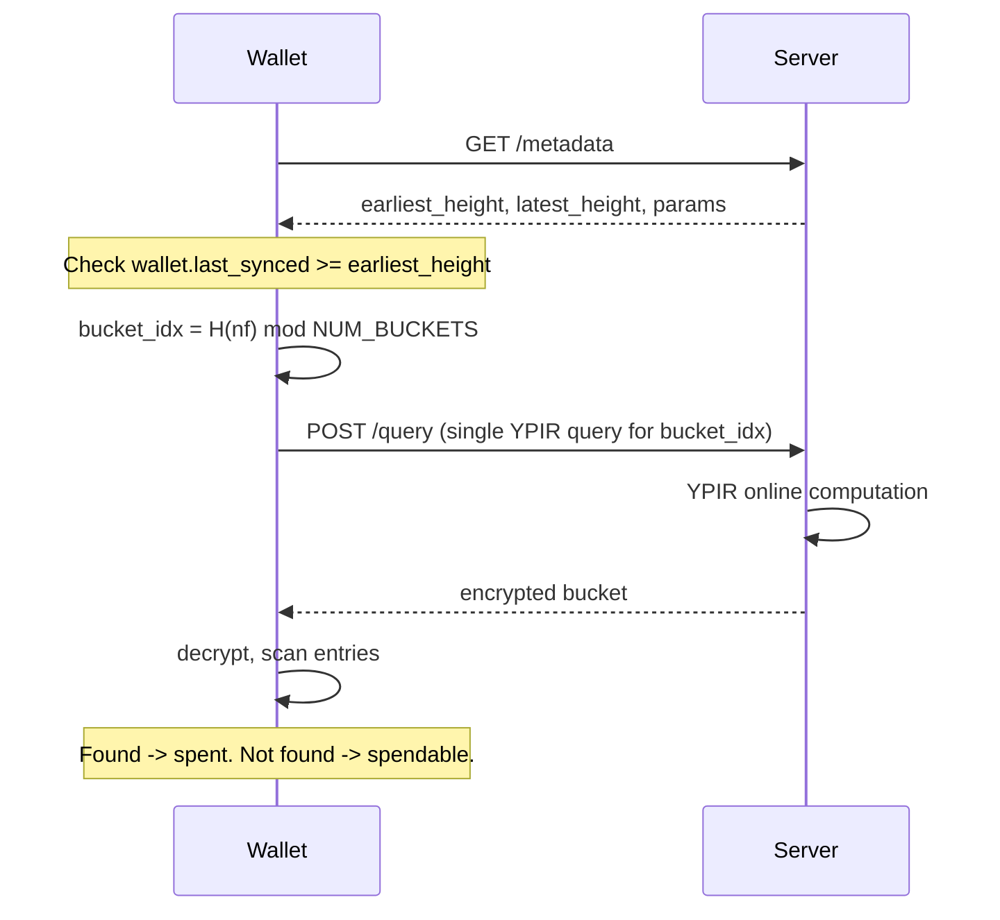

# Spendability PIR: Single-Tier Hash Table Design

## Goal

Let a wallet instantly check if its notes are spendable — privately, with sub-second latency, no sync. A single YPIR query over a bucketed hash table of recent Zcash Orchard nullifiers.

## Fixed Parameters

- `**TARGET_SIZE**`: 1,000,000 nullifiers
- `**CONFIRMATION_DEPTH**`: 10 blocks
- `**NUM_BUCKETS**`: 131,072 (2^17) — load factor ~7.6 at 1M entries
- `**BUCKET_CAPACITY**`: 16
- `**ENTRY_BYTES**`: 32
- `**BUCKET_BYTES**`: 512 (16 x 32)
- **DB size**: ~64 MB (131,072 x 512)

## Architecture




## Server Modes




### Sync Mode

On startup, if the server needs to catch up to the chain tip, it enters **sync mode**:

1. **Fresh start**: estimate `start_height = chain_tip - (target_size / ~20 nfs_per_block)`. Only sync recent history — enough to fill `target_size` nullifiers. No need to sync from NU5 or genesis.
2. **Snapshot resume**: load snapshot, set `start_height = snapshot.latest_height + 1`.
3. Fetch blocks in bulk from `start_height` to chain tip via `GetBlockRange` (batches of up to 10,000 blocks, multi-endpoint parallelism)
4. For each block: insert nullifiers into `HashTableDb`, evict if over `TARGET_SIZE`
5. **No YPIR rebuild per block** — skip the expensive precomputation during catch-up
6. **No PIR serving** — `/query` returns 503 during sync mode, `/health` reports `phase: "syncing"`
7. Once caught up to tip: build YPIR once, snapshot to disk, transition to follow mode

### Follow Mode

Steady-state operation, processing one block at a time as the chain advances:

1. Receive `ChainEvent` from `nf-ingest` (new block or reorg)
2. Insert/rollback nullifiers in `HashTableDb`
3. Evict oldest blocks if over `TARGET_SIZE`
4. Finalize blocks beyond confirmation depth
5. Rebuild YPIR from hash table
6. Atomic swap live PIR
7. Periodically snapshot to disk (async)

## Per-Block Update Loop (Follow Mode)




## Crash-Safe Snapshots

The `HashTableDb` supports serialization to/from disk for crash recovery:

**Snapshot format** (single file, atomic write):

```
[8 bytes]  magic + version
[8 bytes]  latest_height
[8 bytes]  latest_block_hash_height (for reorg detection on resume)
[32 bytes] latest_block_hash
[8 bytes]  num_entries
[8 bytes]  num_blocks_tracked
-- block index (for each tracked block, ordered by height) --
[8 bytes]  height
[32 bytes] block_hash
[4 bytes]  num_slots
[6 bytes each] (bucket_idx: u32, slot_idx: u8, padding) per slot
-- bucket data --
[NUM_BUCKETS * BUCKET_BYTES] raw bucket array
[8 bytes]  checksum (xxhash64 of everything above)
```

**Write path** (async, non-blocking):

1. Serialize `HashTableDb` state to bytes on the update thread (fast memcpy of bucket array + block index iteration)
2. Spawn a blocking task to write: temp file -> fsync -> rename to `snapshot.bin` (atomic)
3. Update loop continues immediately — doesn't wait for disk write

**Read path** (startup):

1. Read `snapshot.bin`, verify checksum
2. Reconstruct `HashTableDb` from bucket data + block index
3. Resume ingesting from `latest_height + 1`
4. On first block, verify `prev_hash` matches our `latest_block_hash` — if not, we missed a reorg while offline; walk back to find fork point

**Snapshot frequency**: every 100 confirmed blocks (~2 hours). Configurable. The snapshot captures only finalized state (the rollback log for the last 10 unconfirmed blocks is rebuilt from re-fetching those blocks on restart).

## Data Flow (Client)




## Workspace Layout

```
spend-pir/
  Cargo.toml              # workspace root
  hashtable-pir/          # hash table + rollback + snapshot logic, no YPIR dependency
  spend-types/            # shared constants, metadata structs, wire format
  nf-ingest/              # lightwalletd subscription, block parsing, reorg detection
  spend-server/           # Axum server, YPIR serving, sync/follow modes, update loop
  spend-client/           # YPIR client, is_spent API
```

## Crate: `hashtable-pir`

Core hash table with per-block tracking, eviction, rollback, and snapshots:

`**HashTableDb`:**

- `insert_block(height: u64, block_hash: [u8; 32], nullifiers: &[[u8; 32]])` — insert all nullifiers from a block, record which bucket slots they occupy
- `rollback_block(block_hash: &[u8; 32])` — remove all nullifiers inserted by that block
- `evict_oldest_block() -> Option<u64>` — remove the lowest-height block's entries, return its height
- `evict_to_target(&mut self)` — evict oldest blocks until `len <= TARGET_SIZE`
- `contains(nf: &[u8; 32]) -> bool` — non-private lookup for testing
- `to_pir_bytes() -> Vec<u8>` — serialize buckets as row-major `NUM_BUCKETS x BUCKET_BYTES`
- `to_snapshot(&self) -> Vec<u8>` — full state serialization for disk persistence
- `from_snapshot(data: &[u8]) -> Result<Self>` — restore from snapshot
- `len() -> usize`, `earliest_height() -> u64`, `latest_height() -> u64`
- `latest_block_hash() -> [u8; 32]` — for reorg detection on resume

**Internal structure:**

```rust
struct HashTableDb {
    buckets: Vec<Bucket>,
    block_index: BTreeMap<u64, BlockRecord>,
    block_hash_to_height: HashMap<[u8; 32], u64>,
    num_entries: usize,
}

struct Bucket {
    entries: [[u8; 32]; BUCKET_CAPACITY],
    count: u8,
}

struct BlockRecord {
    block_hash: [u8; 32],
    slots: Vec<(u32, u8)>,  // (bucket_idx, slot_idx) per nullifier
}
```

`BTreeMap` keyed by height: O(log n) oldest-block access for eviction. `BlockRecord.slots` enables O(k) rollback — directly zero out bucket entries.

**Bucket format (PIR rows):** `BUCKET_CAPACITY` entries of 32 bytes. Unused slots zeroed. Row-major layout.

**Hash function:** `u32::from_le_bytes(nf[0..4]) % NUM_BUCKETS`. Cryptographically random input — uniform distribution guaranteed.

## Crate: `spend-types`

```rust
pub const TARGET_SIZE: usize = 1_000_000;
pub const CONFIRMATION_DEPTH: u64 = 10;
pub const NUM_BUCKETS: usize = 131_072;  // 2^17
pub const BUCKET_CAPACITY: usize = 16;
pub const ENTRY_BYTES: usize = 32;
pub const BUCKET_BYTES: usize = BUCKET_CAPACITY * ENTRY_BYTES;  // 512
pub const DB_BYTES: usize = NUM_BUCKETS * BUCKET_BYTES;          // ~64 MB

pub struct SpendabilityMetadata {
    pub earliest_height: u64,
    pub latest_height: u64,
    pub num_nullifiers: u64,
    pub num_buckets: u64,
    pub phase: ServerPhase,
}

pub enum ServerPhase {
    Syncing { current_height: u64, target_height: u64 },
    Serving,
}

pub struct YpirScenario {
    pub num_items: u64,       // NUM_BUCKETS
    pub item_size_bits: u64,  // BUCKET_BYTES * 8
}
```

Wire format for YPIR queries: length-prefixed `[8-byte LE pqr_len][pqr u64s][pub_params u64s]`.

## Crate: `nf-ingest`

Subscribes to Zcash mainnet via lightwalletd gRPC:

- **Block subscription**: poll chain tip, fetch new blocks via `GetBlockRange`, detect reorgs by tracking `prev_hash` linkage
- **Compact block parsing**: extract `action.nullifier` from Orchard actions
- **Reorg detection**: if `prev_hash` doesn't match last processed block, walk back to fork point
- **Bulk fetch (sync mode)**: fetch ranges of up to 10,000 blocks at a time, multi-endpoint parallelism
- **Event delivery**:

```rust
pub enum ChainEvent {
    NewBlock {
        height: u64,
        hash: [u8; 32],
        prev_hash: [u8; 32],
        nullifiers: Vec<[u8; 32]>,
    },
    Reorg {
        orphaned: Vec<OrphanedBlock>,
        new_blocks: Vec<NewBlock>,
    },
}
```

- **Two modes**: `sync(from, to) -> Stream<ChainEvent>` for bulk catch-up, `follow() -> Stream<ChainEvent>` for tip-tracking with reorg support

## Crate: `spend-server`

**State:**

```rust
struct AppState {
    live_pir: ArcSwap<PirState>,
    update_state: Mutex<UpdateState>,
    config: ServerConfig,
    req_id: AtomicU64,
}

struct ServerConfig {
    target_size: usize,          // 1_000_000
    confirmation_depth: u64,     // 10
    snapshot_interval: u64,      // blocks between snapshots (100)
    data_dir: PathBuf,
    lwd_urls: Vec<String>,
}

struct PirState {
    ypir_server: YServer,
    scenario: YpirScenario,
    metadata: SpendabilityMetadata,
}

struct UpdateState {
    hashtable: HashTableDb,
    rollback_log: RollbackLog,
    blocks_since_snapshot: u64,
}
```

**Routes:**

- `GET /metadata` — returns `SpendabilityMetadata` as JSON (includes `phase`)
- `GET /params` — returns `YpirScenario` as JSON
- `POST /query` — YPIR query; 503 during sync mode
- `GET /health` — status, nullifier count, height, phase

**Startup sequence:**

```rust
async fn run(config: ServerConfig) {
    let chain_tip = fetch_chain_tip(&config.lwd_urls).await;

    let (hashtable, sync_from) = match load_snapshot(&config.data_dir) {
        Ok(ht) => {
            let resume = ht.latest_height() + 1;
            (ht, resume)
        }
        Err(_) => {
            // Fresh start: only sync recent blocks, not the full chain.
            // Estimate how far back we need to go to accumulate ~target_size
            // nullifiers. ~20 nullifiers/block average on mainnet, so:
            let blocks_needed = config.target_size as u64 / 20;
            let start = chain_tip.saturating_sub(blocks_needed);
            (HashTableDb::new(), start)
        }
    };

    // Sync mode: catch up to tip without PIR rebuilds
    if sync_from < chain_tip {
        set_phase(Syncing { current: sync_from, target: chain_tip });
        let events = nf_ingest::sync(sync_from, chain_tip);
        for event in events {
            hashtable.insert_block(...);
            hashtable.evict_to_target();
            // NO YPIR rebuild — just fill the hash table
        }
        save_snapshot(&hashtable, &config.data_dir).await;
    }

    // Build PIR once, start serving
    let pir = build_ypir_server(&hashtable.to_pir_bytes(), scenario);
    live_pir.store(Arc::new(pir));
    set_phase(Serving);

    // Follow mode: per-block updates
    let events = nf_ingest::follow(hashtable.latest_height());
    loop {
        match events.recv().await {
            NewBlock { .. } => { /* insert, evict, rebuild PIR, swap */ }
            Reorg { .. } => { /* rollback, reapply, rebuild PIR, swap */ }
        }
        // Async snapshot every N confirmed blocks
        if state.blocks_since_snapshot >= config.snapshot_interval {
            spawn_snapshot(&hashtable, &config.data_dir);
            state.blocks_since_snapshot = 0;
        }
    }
}
```

## Crate: `spend-client`

```rust
pub struct SpendClient {
    http: reqwest::Client,
    base_url: String,
    scenario: YpirScenario,
    metadata: SpendabilityMetadata,
    ypir_client: YPIRClient,
}

impl SpendClient {
    pub async fn connect(url: &str) -> Result<Self>;
    pub async fn is_spent(&self, nf: &[u8; 32]) -> Result<bool>;
    pub fn earliest_height(&self) -> u64;
}
```

`**is_spent` flow:**

1. `bucket_idx = hash_to_bucket(nf)`
2. `(seed, query) = ypir_client.generate_query_simplepir(bucket_idx)`
3. `response = POST /query` with serialized query
4. `row_bytes = ypir_client.decode_response_simplepir(seed, response)`
5. Scan `BUCKET_CAPACITY` entries in `row_bytes` for `nf` match
6. Return `true` (spent) or `false` (spendable)

**Wallet integration:**

```rust
let client = SpendClient::connect("https://pir.example.com").await?;
if wallet.last_synced_height < client.earliest_height() {
    // need traditional sync first
}
for note in wallet.unspent_notes() {
    if client.is_spent(&note.nullifier).await? {
        wallet.mark_spent(note);
    }
}
```

## Key Design Decisions

- **Sync mode vs follow mode**: on startup, bulk-ingest blocks without YPIR rebuilds (fast catch-up). Once at tip, switch to per-block rebuilds. Avoids rebuilding YPIR thousands of times during initial sync.
- **Async snapshots**: serialize `HashTableDb` to disk periodically (every ~100 confirmed blocks). Atomic file write (temp + fsync + rename). On crash, resume from snapshot height. Rollback log for the last 10 unconfirmed blocks is rebuilt by re-fetching those blocks on restart.
- **Optimistic execution + rollback**: process every block immediately. Rollback log tracks the last 10 unconfirmed blocks. On reorg, undo orphaned blocks by zeroing bucket slots via block index, replay new chain, rebuild PIR.
- **LRU eviction by block height**: when hash table exceeds 1M entries, evict the oldest block. `BTreeMap<height, BlockRecord>` for ordered access. No time-based expiry — count-based, predictable.
- **Simple bucketed hash**: cryptographically random nullifiers distribute uniformly. One PIR query, no cuckoo.
- `**ArcSwap` for lock-free serving**: query handlers never block on the update loop.
- `**earliest_height` from server**: client knows exactly whether PIR covers its sync gap.
- **32-byte entries in PIR rows**: height tracking is server-side only, not wasted in PIR bandwidth.

## Open Parameters (to benchmark)

- `NUM_BUCKETS`: 2^17 chosen for ~7.6 load factor at 1M. May adjust after benchmarking YPIR at 64MB DB size.
- `BUCKET_CAPACITY`: 16. Overflow probability ~0.003% at load factor 7.6.
- `snapshot_interval`: 100 blocks (~2 hours). Tradeoff between disk writes and recovery time.
- YPIR rebuild time at 64MB — must confirm it fits in ~75s block interval.

