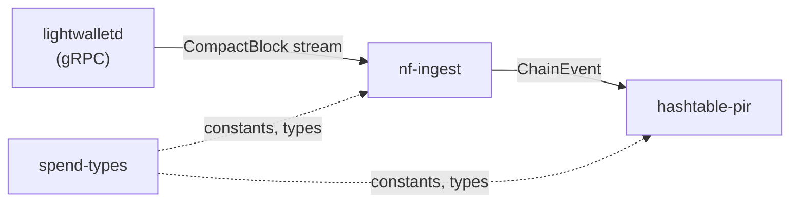

# Reliable Ingest Components

## Scope

Build the data pipeline: lightwalletd -> nf-ingest -> hashtable-pir. This covers three crates plus workspace scaffolding. Out of scope: YPIR/PIR, spend-server, spend-client.




---

## 1. Workspace Setup

Create a Cargo workspace at the repo root.

`**Cargo.toml**` (workspace):

```toml
[workspace]
resolver = "2"
members = ["spend-types", "hashtable-pir", "nf-ingest"]
```

Vendor the two proto files from [zcash/lightwallet-protocol](https://github.com/zcash/lightwallet-protocol/tree/main/walletrpc) into `proto/`:

- `proto/compact_formats.proto`
- `proto/service.proto`

These are small, stable files. Vendoring avoids a git submodule and lets `tonic-build` find them reliably.

---

## 2. Crate: `spend-types`

**Path:** `spend-types/`

Zero external dependencies. Pure constants and types shared across crates.

**Contents:**

- Constants: `TARGET_SIZE`, `CONFIRMATION_DEPTH`, `NUM_BUCKETS`, `BUCKET_CAPACITY`, `ENTRY_BYTES`, `BUCKET_BYTES`, `DB_BYTES`
- `ChainEvent` enum (the contract between nf-ingest and the consumer)
- `SpendabilityMetadata`, `ServerPhase` (for future server use, defined here for shared access)
- Helper: `hash_to_bucket(nf: &[u8; 32]) -> u32` -- `u32::from_le_bytes(nf[0..4]) % NUM_BUCKETS as u32`

**Tests:** Simple unit tests for `hash_to_bucket` distribution properties.

---

## 3. Crate: `hashtable-pir`

**Path:** `hashtable-pir/`

**Dependencies:** `spend-types` (workspace), `xxhash-rust` (for snapshot checksum), `thiserror`.

**Core structs** (per the plan):

- `HashTableDb` -- `buckets: Vec<Bucket>`, `block_index: BTreeMap<u64, BlockRecord>`, `block_hash_to_height: HashMap<[u8;32], u64>`, `num_entries: usize`
- `Bucket` -- `entries: [[u8;32]; 16]`, `count: u8`
- `BlockRecord` -- `block_hash: [u8;32]`, `slots: Vec<(u32, u8)>`

**Public API:**

- `HashTableDb::new() -> Self`
- `insert_block(height, block_hash, nullifiers)` -- insert all nfs, track slots in BlockRecord
- `rollback_block(block_hash)` -- zero out slots, remove from index
- `evict_oldest_block() -> Option<u64>`
- `evict_to_target()` -- evict until `len <= TARGET_SIZE`
- `contains(nf) -> bool`
- `to_pir_bytes() -> Vec<u8>` -- row-major bucket dump
- `to_snapshot() -> Vec<u8>` / `from_snapshot(data) -> Result<Self>`
- `len()`, `earliest_height()`, `latest_height()`, `latest_block_hash()`

**Snapshot format** (as specified in the plan):

- Header: magic + version (8), latest_height (8), latest_block_hash_height (8), latest_block_hash (32), num_entries (8), num_blocks_tracked (8)
- Block index: per block -- height (8) + hash (32) + num_slots (4) + slots (6 bytes each)
- Raw bucket data: `NUM_BUCKETS * BUCKET_BYTES`
- Footer: xxhash64 checksum (8)
- Atomic write: serialize -> write to temp -> fsync -> rename

**Test plan (hashtable-pir):**


| Test                            | What it verifies                                                                            |
| ------------------------------- | ------------------------------------------------------------------------------------------- |
| `test_insert_and_contains`      | Insert a block of nullifiers, verify `contains` returns true for each                       |
| `test_insert_no_false_positive` | After insert, random nfs not in the set return false                                        |
| `test_rollback`                 | Insert block, rollback by hash, verify nfs removed                                          |
| `test_evict_oldest`             | Insert 3 blocks at heights 100/101/102, evict oldest, verify height-100 nfs gone            |
| `test_evict_to_target`          | Insert enough blocks to exceed TARGET_SIZE, call evict_to_target, verify len <= TARGET_SIZE |
| `test_snapshot_roundtrip`       | Build a table, snapshot, restore, verify identical state                                    |
| `test_snapshot_checksum_tamper` | Corrupt one byte in snapshot, verify from_snapshot returns error                            |
| `test_bucket_overflow`          | Insert 17+ nfs mapping to same bucket, verify error/behavior                                |
| `test_multiple_rollbacks`       | Insert blocks A/B/C, rollback C then B, verify A's nfs survive                              |
| `test_empty_block`              | Insert a block with zero nullifiers, verify no crash, eviction works                        |
| `test_pir_bytes_layout`         | Verify `to_pir_bytes()` length == `DB_BYTES` and correct row-major layout                   |
| `test_idempotent_evict`         | Call evict on empty table, verify no panic                                                  |


---

## 4. Crate: `nf-ingest`

**Path:** `nf-ingest/`

**Dependencies:** `spend-types` (workspace), `tonic` (0.12), `prost` (0.13), `tokio`, `tokio-stream`, `tracing`, `thiserror`. Build dependency: `tonic-build`.

**Proto generation:** `build.rs` compiles `proto/compact_formats.proto` and `proto/service.proto` via `tonic_build::configure().build_server(false)`.

**Modules:**

- `**proto`** -- re-export generated types (`CompactBlock`, `CompactOrchardAction`, `BlockRange`, `BlockID`, etc.)
- `**client**` -- `LwdClient` wrapping a `CompactTxStreamerClient<Channel>`, with methods:
  - `connect(endpoints: &[String]) -> Result<Self>` -- connect to first reachable endpoint
  - `get_latest_block() -> Result<(u64, Vec<u8>)>` -- returns (height, hash)
  - `get_block_range(start: u64, end: u64) -> Result<impl Stream<Item = CompactBlock>>`
- `**parser**` -- `extract_nullifiers(block: &CompactBlock) -> Vec<[u8; 32]>` -- iterate `vtx[].actions[].nullifier`, collect into fixed-size arrays
- `**chain_tracker**` -- Tracks the chain of `(height, hash, prev_hash)` for reorg detection:
  - `push_block(height, hash, prev_hash) -> ChainAction` where `ChainAction` is `Extend` or `Reorg { rollback_to: u64 }`
  - Maintains a bounded window (last N block hashes)
- `**ingest**` -- Top-level streams:
  - `sync(client, from, to) -> impl Stream<Item = Result<ChainEvent>>` -- bulk fetch, no reorg detection
  - `follow(client, from_height, from_hash) -> impl Stream<Item = Result<ChainEvent>>` -- poll tip, fetch new blocks, detect reorgs, emit `ChainEvent::Reorg` when needed

**Test plan (nf-ingest):**


| Test                            | What it verifies                                                                                           |
| ------------------------------- | ---------------------------------------------------------------------------------------------------------- |
| `test_extract_nullifiers`       | Hand-craft a `CompactBlock` with known Orchard actions, verify extraction                                  |
| `test_extract_empty_block`      | Block with no transactions, verify empty vec                                                               |
| `test_extract_mixed_pools`      | Block with Sapling spends + Orchard actions, verify only Orchard nullifiers extracted                      |
| `test_chain_tracker_extend`     | Push sequential blocks, verify all return `Extend`                                                         |
| `test_chain_tracker_reorg`      | Push blocks A-B-C, then push B' with different hash at same prev_hash as B, verify `Reorg { rollback_to }` |
| `test_chain_tracker_deep_reorg` | Reorg deeper than 1 block, verify correct rollback depth                                                   |
| `test_sync_stream_mock`         | Mock gRPC server returning 100 blocks, verify sync stream yields correct ChainEvents in order              |
| `test_follow_new_blocks_mock`   | Mock server advancing tip, verify follow emits NewBlock events                                             |
| `test_follow_reorg_mock`        | Mock server simulating a 2-block reorg, verify follow emits Reorg event with correct orphaned blocks       |
| `test_client_connect_fallback`  | Multiple endpoints, first unreachable, verify connects to second                                           |


Mock gRPC tests use `tonic`'s built-in test utilities (`tonic::transport::Server` with an in-process channel) to spin up a fake `CompactTxStreamer` implementation.

---

## 5. Integration Test

**Path:** `nf-ingest/tests/ingest_to_hashtable.rs`

End-to-end test wiring nf-ingest output into hashtable-pir:

1. Create a mock lightwalletd serving 500 blocks with random Orchard nullifiers
2. Run `sync()` stream, feed each `ChainEvent::NewBlock` into `HashTableDb::insert_block`
3. Verify `hashtable.len()` matches total nullifiers inserted
4. Verify `contains()` for a sample of known nullifiers
5. Simulate a reorg by having the mock return a fork -- verify rollback removes orphaned nfs and new nfs are present
6. Snapshot the table, restore, verify identical state

---

## Dependency Summary

```
spend-types      -> (none)
hashtable-pir    -> spend-types, xxhash-rust, thiserror
nf-ingest        -> spend-types, tonic, prost, tokio, tokio-stream, tracing, thiserror
                    (build: tonic-build, prost-build)
```

