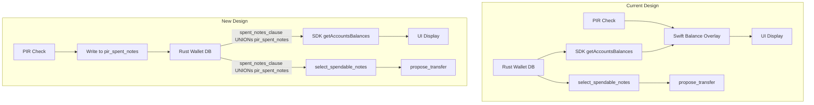
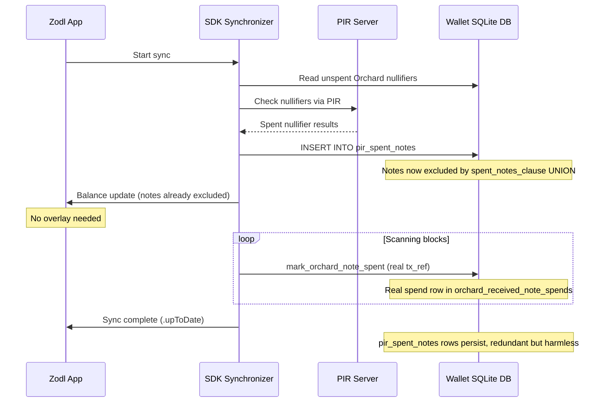

# PIR Integration Redesign: Database-Layer Spent Note Marking

## Motivation

The current PIR integration applies a balance overlay in Swift (`WalletBalancesStore`) that adjusts displayed balances after the fact. This approach:

- Only affects display, not actual note selection in `propose_transfer`
- Required complex promotion/double-subtraction logic with known bugs
- Added `getWitnessableBalances` API surface across the full SDK stack

The new design writes PIR results into a dedicated `pir_spent_notes` table and extends `spent_notes_clause` to include it via UNION. This makes the wallet DB the single source of truth. Both `get_wallet_summary` (balance display) and `select_spendable_notes` (transaction proposals) consult `spent_notes_clause`, so the single change covers all paths.

## Architecture

For the full end-to-end architecture spanning all four repositories (server, client library, wallet DB crate, iOS app), see [docs/pir_wallet_integration.md](../docs/pir_wallet_integration.md).




## Data Flow




## Design Goals

### Startup PIR for Existing Notes

PIR must cover all existing unspent notes at app startup, not just notes newly discovered during the current sync session. This is the primary use case: the wallet was offline for hours or days, and notes received in prior sessions may have been spent in the meantime.

This is handled inherently by the design:

- `query_unspent_orchard_notes` ([spendability.rs:141-147](zcash-swift-wallet-sdk/rust/src/spendability.rs)) selects every note in `orchard_received_notes` that has no corresponding row in `orchard_received_note_spends`, regardless of when the note was discovered.
- The startup trigger in [RootInitialization.swift:232-244](zodl-ios/modules/Sources/Features/Root/RootInitialization.swift) fires `checkSpendabilityPIR` immediately if `syncStatus != .upToDate`, covering the offline-then-relaunch scenario.
- No special-case logic is needed; the same PIR check that handles newly discovered notes also handles pre-existing ones.

### Single Source of Truth

Both balance display (`get_wallet_summary` via `spent_notes_clause`) and note selection for spending (`select_spendable_notes` via `spent_notes_clause`) consult the same exclusion logic. By extending `spent_notes_clause` to UNION `pir_spent_notes`, both paths are covered without any overlay or dual-accounting logic.

### Prevention of Actual Spend Failures

Unlike the previous Swift overlay (which only adjusted displayed balances), `pir_spent_notes` entries flow through `spent_notes_clause` into `select_spendable_notes`, preventing `propose_transfer` from selecting PIR-spent notes. This eliminates the scenario where a transaction is built with a spent note and rejected at broadcast.

### Feature-Flagged PIR

All PIR runtime paths in `zcash_client_sqlite` are gated behind a Cargo feature flag `spendability-pir` (disabled by default). The `pir_spent_notes` table is always created (migration is unconditional) to keep the migration DAG identical across all builds. When the feature is off:

- The `pir_spent_notes` table exists but is empty and unused
- `spent_notes_clause` returns the original query with no UNION
- The crate behaves identically to upstream

This ensures the `zcash_client_sqlite` crate remains unchanged for non-PIR consumers. The SDK enables the feature explicitly in its `Cargo.toml`. The PIR FFI code in `spendability.rs` (which lives in the SDK crate, not `zcash_client_sqlite`) is unaffected — it only calls into the table when it exists.

### No Race Condition Between PIR and Scanning

PIR writes to `pir_spent_notes` while scanning writes to `orchard_received_note_spends`. These are separate tables, so there is no write contention or row conflict between them.

**Layer 1 — Read-time exclusion:** `query_unspent_orchard_notes` excludes notes that already have a row in `orchard_received_note_spends` OR in `pir_spent_notes`. If scanning marks a note spent before PIR reads the table, PIR never sees that note.

**Layer 2 — Atomic conditional insert:** If scanning marks a note spent *after* PIR has already read it (during the PIR network round-trip), the PIR write-back uses an atomic conditional insert:

```sql
INSERT INTO pir_spent_notes (note_id)
SELECT :note_id
WHERE NOT EXISTS (
    SELECT 1 FROM orchard_received_note_spends
    WHERE orchard_received_note_id = :note_id
)
AND NOT EXISTS (
    SELECT 1 FROM pir_spent_notes
    WHERE note_id = :note_id
)
```

SQLite serializes all writes under a single write lock, so both `NOT EXISTS` checks and the `INSERT` execute atomically. If scanning inserted a real spend row between PIR's read and PIR's write, the first `NOT EXISTS` condition fails and the PIR row is never created.

**Result:** For any given note, the exclusion comes from either `orchard_received_note_spends` (real spend from scanning) or `pir_spent_notes` (PIR), never duplicated across both. No redundant rows, no override, no cleanup edge cases.

## Design Trade-offs and Decisions

### Decision 1: Separate `pir_spent_notes` Table vs Modifying Existing Tables

**Chosen:** A dedicated `pir_spent_notes` table with a single `note_id` column.

**Alternatives considered:**

- **Add a column to `orchard_received_note_spends`:** This table has a FK constraint `REFERENCES transactions(id_tx) ON DELETE CASCADE`, so each row requires a valid transaction ID. PIR results have no associated transaction. To make this work, we'd need to insert synthetic rows into the `transactions` table with a fake `txid` (which is `BLOB NOT NULL UNIQUE`), and ensure the fake transaction passes `tx_unexpired_condition`. This is fragile, couples PIR to transaction lifecycle semantics, and pollutes the transactions table.

- **Add a `pir_spent` boolean column to `orchard_received_notes`:** This would avoid a new table but modifies a core upstream table, making the fork harder to maintain. It also changes the semantics of a "received note" record from being purely about what was received to also encoding external spend status.

**Rationale:** A separate table keeps PIR concerns isolated. No synthetic data in existing tables, no schema changes to core upstream tables, and the table can be created via an unconditional migration without affecting non-PIR builds (it simply stays empty).

### Decision 2: Database-Layer Integration vs Swift Overlay

**Chosen:** Write PIR results into the wallet DB and extend `spent_notes_clause` to exclude them.

**Alternative:** The previous Swift overlay approach (`WalletBalancesStore` adjustments).

**Rationale:** The overlay only affected display, not `select_spendable_notes`. This meant `propose_transfer` could still select a PIR-identified-spent note, leading to broadcast failures. Moving to the DB layer makes exclusion authoritative: both balance display and transaction construction consult the same `spent_notes_clause` UNION, eliminating the gap entirely. It also removes ~200 lines of overlay logic, the `getWitnessableBalances` API surface, and the double-subtraction bugs that came with it.

### Decision 3: Unconditional Migration, Feature-Gated Runtime Paths

**Chosen:** The `pir_spent_notes` table is always created (migration runs regardless of the `spendability-pir` feature flag). Only the runtime query paths (`spent_notes_clause` UNION, PIR write-back) are `#[cfg]`-gated.

**Alternative:** Gate the entire migration behind `#[cfg(feature = "spendability-pir")]`.

**Rationale:** `schemerz` (the migration framework) tracks applied migrations by UUID. If a developer builds without the feature, creates a DB, then later enables the feature, the migration system sees a new unresolved migration and must apply it. This works, but the migration DAG differs across builds, which is unusual and fragile. An unconditional migration keeps the DAG identical everywhere. For non-PIR builds, the table is empty and the unconditional `DELETE FROM pir_spent_notes` in `truncate_to_height` is a harmless no-op.

### Decision 4: UNION in `spent_notes_clause` vs Separate Query Modifications

**Chosen:** Extend the single `spent_notes_clause` function to UNION `pir_spent_notes`.

**Alternative:** Modify each individual query (`get_wallet_summary`, `select_spendable_notes`, `select_unspent_notes`, `get_spendable_note`, `select_unspent_note_meta`, `unspent_notes_meta`) to add a `NOT IN pir_spent_notes` clause.

**Rationale:** `spent_notes_clause` is already the centralized chokepoint used by all six query sites. One change to this function covers all paths. Modifying each query individually would be error-prone (easy to miss one) and harder to maintain.

**Semantic note:** The UNION introduces an asymmetry: real spend entries are filtered by `tx_unexpired_condition` (they can "un-exclude" a note if the spending transaction expires), while PIR entries are unconditional (they never expire). This is intentional — PIR entries reflect confirmed on-chain state, not pending transactions. The asymmetry is resolved by `truncate_to_height` clearing all PIR rows on reorg.

### Decision 5: Permanent PIR Rows with Truncation Cleanup

**Chosen:** PIR rows persist indefinitely during normal operation, cleared only by `truncate_to_height` (reorg/rescan) or FK cascade (account deletion).

**Alternatives considered:**

- **Clear on startup:** Wipe `pir_spent_notes` on every app launch, relying on the startup PIR check to re-populate. Simple, but creates a window where balance is incorrect (shows pre-PIR values until the first PIR check completes).

- **Periodic reconciliation:** A background job that deletes `pir_spent_notes` rows for notes that now have a real spend in `orchard_received_note_spends`. Adds complexity with no functional benefit — the redundant rows are harmless (UNION deduplicates).

- **TTL / expiry column:** Add a timestamp and periodically purge old entries. Over-engineering for a table that will typically have 0-10 rows.

**Rationale:** Permanent rows are the simplest correct approach. The only scenario where stale rows matter is a chain reorg that reverts a spend. `truncate_to_height` already handles this by clearing the table, and the subsequent re-scan triggers a fresh PIR check. The FK cascade handles account deletion. No periodic jobs, no startup wipe, no TTL logic.

### Decision 6: Application-Level Retry vs `busy_timeout`

**Chosen:** Explicit exponential backoff retry loop (8 retries, 50ms–6.4s) with no `busy_timeout` set.

**Alternatives considered:**

- **`busy_timeout` only:** SQLite retries internally. Simple, but the retry behavior is opaque (no logging of individual attempts) and the timeout is a single fixed duration with no backoff.

- **Both layers:** `busy_timeout` for the common case, retry loop for edge cases. The interaction is non-obvious: each application retry triggers a fresh `busy_timeout` cycle, making the actual worst-case wait multiplicative rather than additive.

**Rationale:** A single retry mechanism is easier to reason about. The application loop provides visibility (can log each attempt), predictable backoff timing, and a clear error path when all retries are exhausted. `SQLITE_BUSY` fails fast (no wait), so each retry attempt is cheap.

### Decision 7: Keeping the FFI Return Value for Diagnostics

**Chosen:** `zcashlc_check_wallet_spendability` continues to return `SpendabilityCheckResult` with `spent_note_ids` and `total_spent_value`, even though balance effects now come from the DB.

**Alternative:** Simplify the return to a success/failure indicator.

**Rationale:** The PIR debug screen (`PIRDebugStore.swift`) displays the result for diagnostic purposes (which notes were found spent, heights covered). Removing the return type would break this visibility. The result is stored in `pirSpendabilityResult` shared state, which is read-only for the UI — it no longer drives balance logic.

## Implementation Details

### 1. Feature Flag and `pir_spent_notes` Table (Schema Migration)

Add a `spendability-pir` feature to [zcash_client_sqlite/Cargo.toml](zcash_client_sqlite/zcash_client_sqlite/Cargo.toml):

```toml
[features]
# ...existing features...

## Enables PIR (Private Information Retrieval) spent note tracking.
spendability-pir = []
```

Enable it in [zcash-swift-wallet-sdk/Cargo.toml](zcash-swift-wallet-sdk/Cargo.toml):

```toml
zcash_client_sqlite = { path = "...", features = ["orchard", "transparent-inputs", "unstable", "serde", "spendability-pir"] }
```

A new table in `zcash_client_sqlite` to hold PIR-identified spent notes. No FK to `transactions` — clean and self-contained. An FK to `orchard_received_notes(id)` with `ON DELETE CASCADE` ensures that PIR entries are automatically cleaned up on wallet rescan or account deletion, matching the pattern used by `orchard_received_note_spends`.

```sql
CREATE TABLE pir_spent_notes (
    note_id INTEGER NOT NULL PRIMARY KEY
        REFERENCES orchard_received_notes(id) ON DELETE CASCADE
)
```

This table is Orchard-only. There is no `pool` column since PIR only applies to Orchard notes.

**Migration:** Follow the existing pattern in [migrations/nullifier_map.rs](zcash_client_sqlite/zcash_client_sqlite/src/wallet/init/migrations/nullifier_map.rs). Create a new migration module `pir_spent_notes.rs` with a UUID, depending on `account_delete_cascade` (the current leaf migration). The migration is **unconditional** (not gated by `#[cfg(feature = "spendability-pir")]`) — the table is always created regardless of the feature flag. This keeps the migration DAG identical across all builds, avoiding edge cases with `schemerz` when toggling features. The feature flag only gates the runtime/query paths that read from or write to the table. Register it in [migrations.rs](zcash_client_sqlite/zcash_client_sqlite/src/wallet/init/migrations.rs) without any feature gate. Add the table DDL constant to [db.rs](zcash_client_sqlite/zcash_client_sqlite/src/wallet/db.rs).

### 2. Modify `spent_notes_clause` to Include PIR Table

In [common.rs:112](zcash_client_sqlite/zcash_client_sqlite/src/wallet/common.rs), extend the function to UNION PIR exclusions:

```rust
pub(crate) fn spent_notes_clause(table_prefix: &str) -> String {
    let base = format!(
        r#"
        SELECT rns.{table_prefix}_received_note_id
        FROM {table_prefix}_received_note_spends rns
        JOIN transactions stx ON stx.id_tx = rns.transaction_id
        WHERE {unexpired}
        "#,
        unexpired = tx_unexpired_condition("stx")
    );
    #[cfg(feature = "spendability-pir")]
    if table_prefix == "orchard" {
        // PIR rows are unconditional (no tx_unexpired_condition) because they
        // reflect confirmed on-chain nullifier state, not pending transactions.
        // Stale PIR rows are cleared by truncate_to_height on reorg/rescan;
        // see also UNSPENT_ORCHARD_NOTES_SQL in spendability.rs for a parallel
        // exclusion that must be kept in sync.
        return format!("{base} UNION SELECT note_id FROM pir_spent_notes");
    }
    base
}
```

The `#[cfg(feature = "spendability-pir")]` gate ensures the UNION is only compiled in when the `spendability-pir` feature is enabled. Without the feature, the function is identical to upstream. This single change covers all Orchard query paths: `get_wallet_summary`, `select_spendable_notes`, `select_unspent_notes`, `get_spendable_note`, etc.

**Semantic note:** The base query filters real spend entries by `tx_unexpired_condition` — a note can become "un-excluded" if its spending transaction expires. PIR entries have no such condition; they are unconditional exclusions. This asymmetry is intentional: PIR entries reflect confirmed on-chain state (the nullifier exists in the chain's nullifier set), not pending transaction status. The only invalidation path is `truncate_to_height`, which clears all PIR rows on reorg/rescan so the next PIR check re-queries the canonical chain state.

Also update `UNSPENT_ORCHARD_NOTES_SQL` in [spendability.rs:141-147](zcash-swift-wallet-sdk/rust/src/spendability.rs) to also exclude notes in `pir_spent_notes`:

```sql
SELECT rn.id, rn.nf, rn.value FROM orchard_received_notes rn
WHERE rn.nf IS NOT NULL
AND NOT EXISTS (
    SELECT 1 FROM orchard_received_note_spends sp
    WHERE sp.orchard_received_note_id = rn.id
)
AND NOT EXISTS (
    SELECT 1 FROM pir_spent_notes pir
    WHERE pir.note_id = rn.id
)
```

This ensures PIR re-checks skip already-marked notes. This duplicates the `pir_spent_notes` exclusion that `spent_notes_clause` also provides — both locations must be kept in sync. Add a comment in each referencing the other: in `spent_notes_clause` note that `UNSPENT_ORCHARD_NOTES_SQL` in `spendability.rs` has a parallel exclusion, and vice versa.

### 3. Modify `zcashlc_check_wallet_spendability` to Write Results

Currently opens DB read-only ([spendability.rs:200-202](zcash-swift-wallet-sdk/rust/src/spendability.rs)). Must change to read-write so it can:

1. Read unspent nullifiers (existing `query_unspent_orchard_notes`, now also excluding `pir_spent_notes`)
2. Send to PIR server (existing flow)
3. Write spent results back using an atomic conditional insert per note:

```sql
INSERT INTO pir_spent_notes (note_id)
SELECT :note_id
WHERE NOT EXISTS (
    SELECT 1 FROM orchard_received_note_spends
    WHERE orchard_received_note_id = :note_id
)
AND NOT EXISTS (
    SELECT 1 FROM pir_spent_notes
    WHERE note_id = :note_id
)
```

The function already has `note.id` (the `orchard_received_notes.id` primary key) for each spent note, so the insert is straightforward. The `NOT EXISTS` guards ensure no row is created if scanning already marked the note spent during the PIR network round-trip (see "No Race Condition" in Design Goals).

**DB access concern:** The main SDK sync loop also writes to the DB via `@DBActor`. SQLite allows only one writer at a time, even in WAL mode. If the PIR INSERT collides with a sync write, SQLite returns `SQLITE_BUSY`. Neither the SDK nor `zcash_client_sqlite` sets `busy_timeout`, so by default this error is returned immediately with no automatic retry.

To prevent silent write skipping, the PIR write-back wraps each INSERT in an explicit retry loop with exponential backoff. No `busy_timeout` is set — each attempt fails fast on `SQLITE_BUSY`, and the retry loop controls all timing:

```rust
fn insert_pir_spent_note(conn: &rusqlite::Connection, note_id: i64) -> anyhow::Result<()> {
    const MAX_RETRIES: u32 = 8;
    const BASE_DELAY_MS: u64 = 50;

    for attempt in 0..=MAX_RETRIES {
        match conn.execute(
            "INSERT INTO pir_spent_notes (note_id)
             SELECT ?1
             WHERE NOT EXISTS (
                 SELECT 1 FROM orchard_received_note_spends
                 WHERE orchard_received_note_id = ?1
             )
             AND NOT EXISTS (
                 SELECT 1 FROM pir_spent_notes WHERE note_id = ?1
             )",
            [note_id],
        ) {
            Ok(_) => return Ok(()),
            Err(rusqlite::Error::SqliteFailure(err, _))
                if err.code == rusqlite::ffi::ErrorCode::DatabaseBusy =>
            {
                if attempt == MAX_RETRIES {
                    return Err(anyhow::anyhow!(
                        "pir_spent_notes insert for note_id={note_id} failed: \
                         database busy after {MAX_RETRIES} retries"
                    ));
                }
                let delay = BASE_DELAY_MS * 2u64.pow(attempt);
                std::thread::sleep(std::time::Duration::from_millis(delay));
            }
            Err(e) => return Err(e.into()),
        }
    }
    unreachable!()
}
```

Retry schedule: 50ms, 100ms, 200ms, 400ms, 800ms, 1.6s, 3.2s, 6.4s (total max wait ~12.75s). After exhausting retries, the error propagates up to the FFI caller so it is never silently swallowed.

Replace `SQLITE_OPEN_READ_ONLY` with `SQLITE_OPEN_READ_WRITE` in the flags. Keep `SQLITE_OPEN_NO_MUTEX` — it controls threading mode (multi-thread, no serialization), which is appropriate since the PIR FFI call creates and uses the connection entirely within a single `Task.detached` closure. Note: this connection must not be shared across threads without changing the threading mode.

### 4. Cleanup on Truncation Only

No periodic or manual cleanup of `pir_spent_notes` is needed during normal operation. Rows persist across app restarts and are cleared only in two situations:

- **Chain truncation (reorg):** `truncate_to_height` in [wallet.rs](zcash_client_sqlite/zcash_client_sqlite/src/wallet.rs) deletes all `pir_spent_notes` rows unconditionally. After a reorg, the on-chain nullifier set may have changed (a previously-spent note could become unspent if its spending transaction was reverted). Clearing the table ensures no stale PIR exclusions persist. The next PIR check re-populates it from the current canonical chain state. This is safe because `truncate_to_height` is always followed by re-scanning, which triggers PIR via the existing `.foundTransactions` refire logic.

  Add to `truncate_to_height` in the **unconditional** section (before the `if truncation_height < last_scanned_height` block, alongside scan_queue and transaction cleanup at [wallet.rs:3285-3321](zcash_client_sqlite/zcash_client_sqlite/src/wallet.rs)):

  ```sql
  DELETE FROM pir_spent_notes
  ```

  This must be unconditional (not inside the `if` block) because PIR state can be stale relative to the new chain tip regardless of whether we've scanned past the truncation height. Since the table is created unconditionally (migration is not feature-gated), this DELETE is valid in all builds. For non-PIR builds, the table is always empty, so the DELETE is a no-op.

- **Account deletion:** The FK `REFERENCES orchard_received_notes(id) ON DELETE CASCADE` ensures that when an account is deleted (cascading through `accounts` → `orchard_received_notes`), all associated `pir_spent_notes` rows are automatically removed.

**During normal operation:**

- **Truly spent notes:** Scanning eventually adds a real spend row in `orchard_received_note_spends`. The `pir_spent_notes` row becomes redundant but harmless — `UNION` in `spent_notes_clause` deduplicates.
- **On restart:** `UNSPENT_ORCHARD_NOTES_SQL` excludes notes in both `orchard_received_note_spends` and `pir_spent_notes`, so PIR will not re-query notes it has already marked.
- **False positives:** PIR queries the actual nullifier set from the chain, so a false positive would require corrupted PIR server data. This is not expected to be an issue. In the unlikely event it occurs, an in-app rescan (which calls `truncate_to_height`) clears all PIR rows, and the subsequent PIR check re-queries the canonical state.

This eliminates the need for a cleanup FFI, Swift SDK wiring, and trigger logic in `RootInitialization.swift`.

### 5. Coexistence with Real Spend Entries

PIR and scanning write to **separate tables** (`pir_spent_notes` vs `orchard_received_note_spends`), so there is no row conflict.

When scanning finds the real spend and calls `mark_orchard_note_spent(conn, real_tx_ref, &nf)`:

- If PIR has not yet marked the note: scanning inserts into `orchard_received_note_spends`. When PIR later tries to write, the atomic `NOT EXISTS` guard on `orchard_received_note_spends` prevents the `pir_spent_notes` row from being created.
- If PIR has already marked the note: scanning inserts into `orchard_received_note_spends`. The note is now excluded by both tables, but `spent_notes_clause` uses UNION so it still appears only once in the exclusion set. The `pir_spent_notes` row persists but is redundant and harmless.

In either case, the note is correctly excluded and no data is lost.

### 6. Remove the Swift Balance Overlay

After the Rust-layer integration is complete, remove the following from the Swift/Zodl side:

**SDK layer (zcash-swift-wallet-sdk):**

- Remove `getWitnessableBalances()` from `ZcashRustBackendWelding`, `ZcashRustBackend`, `Synchronizer`, `SDKSynchronizer`, `CombineSDKSynchronizer`, `ClosureSDKSynchronizer`, and generated mocks

**Zodl layer (zodl-ios):**

- [WalletBalancesStore.swift](zodl-ios/modules/Sources/Features/WalletBalances/WalletBalancesStore.swift): Remove the `witnessableBalance` parameter from `balanceUpdated`, the `pirActive` branches in `updateBalances` and `synchronizerStateChanged`, and the entire PIR overlay block in `balanceUpdated`. The `@Shared(.inMemory(.pirSpendabilityResult))` declaration stays since `PIRDebugStore` reads it
- [SDKSynchronizerInterface.swift](zodl-ios/modules/Sources/Dependencies/SDKSynchronizer/SDKSynchronizerInterface.swift): Remove `getWitnessableBalances` closure
- [SDKSynchronizerLive.swift](zodl-ios/modules/Sources/Dependencies/SDKSynchronizer/SDKSynchronizerLive.swift): Remove `getWitnessableBalances` wiring
- [SDKSynchronizerTest.swift](zodl-ios/modules/Sources/Dependencies/SDKSynchronizer/SDKSynchronizerTest.swift): Remove `getWitnessableBalances` mock
- [RootInitialization.swift](zodl-ios/modules/Sources/Features/Root/RootInitialization.swift): Remove the entire `checkRestoreWalletFlag` PIR block (lines 169-185) — both the `pirSpendabilityResult` clearing and the `CancelPIRRefireId`/`DebouncePIRId` cancellations. With PIR results persisted in the DB permanently, there is no overlay to clear and refire is harmless (idempotent inserts). The `checkSpendabilityPIRResult` handler and `pirSpendabilityResult` shared state are **kept** so that the PIR debug screen (`PIRDebugStore.swift`) retains visibility into PIR results. The trigger logic (`checkSpendabilityPIR`) and result handler stay as-is — the only difference is that the result is now purely diagnostic (balance effects come from the DB, not the shared state).
- **Balance refresh after PIR:** After the PIR FFI call writes to the DB, the balances returned by `get_wallet_summary` change (PIR-marked notes are now excluded). The UI must be notified to re-query. In the `checkSpendabilityPIRResult` handler, after storing the diagnostic result, dispatch `.home(.walletBalances(.updateBalances))` (the full cross-scope action path, matching the pattern in [RootCoordinator.swift](zodl-ios/modules/Sources/Features/Root/RootCoordinator.swift)) to trigger an immediate balance refresh from the DB. Without this, the UI would only update on the next periodic `synchronizerStateChanged` event, creating a visible delay between PIR completion and the balance reflecting PIR results.

## Testing Strategy

Tests are split across the two crates that contain PIR-related changes.

### SDK crate (`zcash-swift-wallet-sdk/rust/src/spendability.rs`)

The existing test module uses an in-memory SQLite database via `create_test_db()` with helpers `insert_note`, `mark_spent`, and `make_nf`. Extend this infrastructure:

**Setup:** Add `pir_spent_notes` to `create_test_db()`:

```sql
CREATE TABLE pir_spent_notes (
    note_id INTEGER NOT NULL PRIMARY KEY
        REFERENCES orchard_received_notes(id) ON DELETE CASCADE
);
```

Add a helper:

```rust
fn mark_pir_spent(conn: &rusqlite::Connection, note_id: i64) {
    conn.execute("INSERT INTO pir_spent_notes (note_id) VALUES (?1)", [note_id]).unwrap();
}
```

**Tests for `query_unspent_orchard_notes`:**

| Test | Setup | Assert |
|---|---|---|
| `excludes_pir_spent_notes` | Insert notes 1,2,3; PIR-mark note 2 | Returns notes 1,3 only |
| `excludes_both_pir_and_real_spent` | Insert notes 1,2,3; real-spend note 2, PIR-mark note 3 | Returns note 1 only |
| `pir_and_real_spend_same_note` | Insert note 1; both real-spend and PIR-mark it | Returns empty |

**Tests for `insert_pir_spent_note`:**

| Test | Setup | Assert |
|---|---|---|
| `insert_basic` | Insert note 1, call `insert_pir_spent_note(1)` | Row exists in `pir_spent_notes` |
| `insert_skips_real_spent` | Insert note 1, real-spend it, call `insert_pir_spent_note(1)` | `pir_spent_notes` is empty (NOT EXISTS guard worked) |
| `insert_idempotent` | Insert note 1, call `insert_pir_spent_note(1)` twice | Single row, no error |
| `insert_fk_cascade` | Insert note 1, PIR-mark it, delete the note | `pir_spent_notes` is empty (CASCADE fired) |

**Test for `SQLITE_BUSY` retry:**

| Test | Setup | Assert |
|---|---|---|
| `insert_retries_on_busy` | Open a second connection, begin an exclusive transaction on it, call `insert_pir_spent_note` on the first connection from a background thread, commit the exclusive transaction after a short delay | Insert succeeds after retry (no error) |

### `zcash_client_sqlite` crate

**Schema verification:** Add `db::TABLE_PIR_SPENT_NOTES` to the `expected_tables` list in `verify_schema` ([init.rs:784-812](zcash_client_sqlite/zcash_client_sqlite/src/wallet/init.rs)). This test pins the DDL and catches any drift between the migration output and the expected schema constant.

**Migration test:** Follow the existing pattern (each migration module has a test that applies it to a DB at the prior state and verifies the result). For `pir_spent_notes.rs`, verify:
- Table is created with the expected schema
- FK constraint is enforced (insert with nonexistent `note_id` fails)
- CASCADE works (delete parent note, PIR row disappears)

**`truncate_to_height` clears PIR rows:** Using the existing `TestBuilder` infrastructure, insert a PIR row, call `truncate_to_height`, and verify `pir_spent_notes` is empty afterward.

### What is NOT tested at the Rust level

- **End-to-end PIR server interaction:** The `spend_client::SpendClientBlocking` calls are not mocked in these tests. The PIR server round-trip is tested at the integration/manual level via the iOS app and PIR debug screen.
- **Swift-layer removal:** Verified by compilation (removed APIs will cause build errors if any call sites remain) and manual testing of balance display behavior.
- **Balance UI refresh timing:** The `walletBalances(.updateBalances)` action after PIR is verified by manual testing — observing that the displayed balance updates immediately after PIR completes, not on the next sync state event.

## Issues to Address

### Issue 1: DB Access Mode

`zcashlc_check_wallet_spendability` currently opens the DB read-only (`SQLITE_OPEN_READ_ONLY`). Must change to read-write to insert into `pir_spent_notes`. This means it can contend with the sync loop's DB writes. SQLite only allows one writer at a time, and neither the SDK nor `zcash_client_sqlite` sets `busy_timeout`, so without mitigation a concurrent write would return `SQLITE_BUSY` immediately and silently skip the PIR insert.

**Mitigation:** An explicit exponential backoff retry loop (8 retries, 50ms base delay) wraps each PIR INSERT. No `busy_timeout` is set — each attempt fails fast on `SQLITE_BUSY`, and the retry loop controls all timing (total max wait ~12.75s). After all retries are exhausted, the error propagates (never silently dropped).

### Issue 2: Timing Window

Between note discovery and PIR response, a note briefly appears spendable. If the user initiates a spend during this window, `propose_transfer` will select the note. This is the same gap as the current design. Mitigation: the window is short (one PIR round-trip). Could be further reduced by disabling spend UI until first PIR check completes (existing behavior via `syncStatus` gating).

### Issue 3: PIR Refire During Sync

The current design refires PIR when `.foundTransactions` events occur during sync. With the new design, each refire will:

- Re-read unspent nullifiers (PIR-marked ones are already excluded by `UNSPENT_ORCHARD_NOTES_SQL`)
- Check any new nullifiers with PIR
- Write new results into `pir_spent_notes`

This is correct behavior. The updated `UNSPENT_ORCHARD_NOTES_SQL` query excludes both `orchard_received_note_spends` and `pir_spent_notes`, so previously-marked notes are skipped.

### Issue 4: Schema Migration

A new migration is needed to create the `pir_spent_notes` table. This follows the existing schemerz migration pattern in the crate. The migration depends on the current leaf (`account_delete_cascade`). Since this is a purely additive change (new table, no existing data modified), the migration is safe for existing wallets.