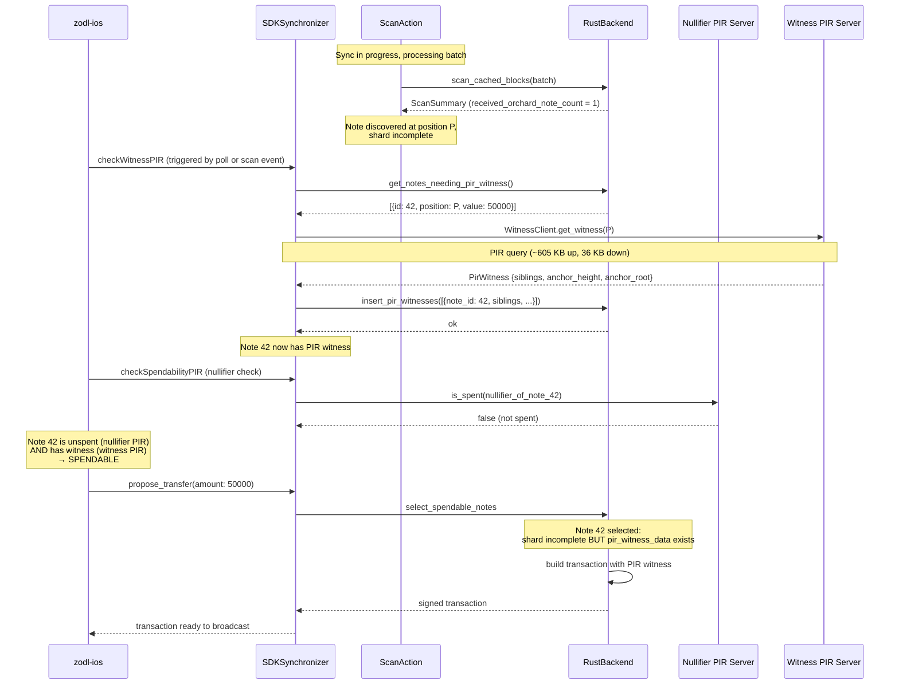

# Note Witness PIR — ZODL Integration Design

## Context

The [witness server design](pir_witness_acceleration_design_79b54db9.plan.md) defines a PIR-based system that privately serves Merkle authentication paths for Orchard notes during sync. This document designs the **wallet-side integration** — how the witness PIR client connects through `zcash_client_sqlite`, the SDK's Rust FFI, the Swift SDK layer, and into the zodl-ios app.

The existing nullifier PIR integration provides the pattern. Where nullifier PIR answers "is this note spent?", witness PIR answers "what is this note's authentication path?" — enabling the note to be spent before the wallet finishes scanning.

### What nullifier PIR does NOT solve

The [parallel note witness scanning analysis](../future/2_parallel_note_witness_scanning_e96856ee.plan.md) identified two independent blockers to spending a discovered note:

1. **Nullifier presence** (is the note spent?) — solved by nullifier PIR
2. **Witness construction** (can we build a valid spend proof?) — **unsolved until now**

Nullifier PIR bypasses the `unscanned_tip_exists` gate for Orchard notes, but `select_spendable_notes_matching_value` still enforces `scan_state.max_priority <= :scanned_priority` — the note's shard must be fully scanned before it's eligible for coin selection. Even if we know the note is unspent (via PIR), we can't spend it because `witness_at_checkpoint_id_caching` on the ShardTree fails without a complete shard.

Witness PIR removes this second blocker by providing the authentication path externally.

## Architecture overview

```
┌─────────────────────────────────────────────────────────────────┐
│  zodl-ios                                                       │
│  ┌────────────────┐  ┌──────────────────────────────────────┐   │
│  │ PIRDebugStore   │  │ RootInitialization                   │   │
│  │ (witness tab)   │  │ .checkWitnessPIR on note discovery   │   │
│  └───────┬────────┘  └──────────┬───────────────────────────┘   │
│          │                      │                               │
│          ▼                      ▼                               │
│  ┌──────────────────────────────────────────────────────────┐   │
│  │ SDKSynchronizerClient                                    │   │
│  │ .fetchNoteWitnesses(pirServerUrl:)                       │   │
│  │ .getPIRWitnessedNotes()                                  │   │
│  └──────────────────────────┬───────────────────────────────┘   │
└─────────────────────────────┼───────────────────────────────────┘
                              │
┌─────────────────────────────┼───────────────────────────────────┐
│  zcash-swift-wallet-sdk     │                                   │
│  ┌──────────────────────────┴───────────────────────────────┐   │
│  │ SDKSynchronizer                                          │   │
│  │ .fetchNoteWitnesses(pirServerUrl:progress:)              │   │
│  └────────────┬─────────────────────────────────────────────┘   │
│               │                                                 │
│  ┌────────────┴──────────┐   ┌──────────────────────────────┐   │
│  │ ZcashRustBackend      │   │ WitnessBackend               │   │
│  │ @DBActor (DB ops)     │   │ (network-only, no DB)        │   │
│  │ .getNotesNeedingWit() │   │ .fetchWitnesses(positions:)  │   │
│  │ .insertPIRWitnesses() │   │                              │   │
│  └────────────┬──────────┘   └──────────┬───────────────────┘   │
│               │                         │                       │
│  ┌────────────┴─────────────────────────┴───────────────────┐   │
│  │ Rust FFI (lib.rs + witness.rs)                           │   │
│  │ zcashlc_get_notes_needing_pir_witness                    │   │
│  │ zcashlc_insert_pir_witnesses                             │   │
│  │ zcashlc_fetch_pir_witnesses (network + decode)           │   │
│  └────────────┬─────────────────────────────────────────────┘   │
└───────────────┼─────────────────────────────────────────────────┘
                │
┌───────────────┼─────────────────────────────────────────────────┐
│  zcash_client_sqlite                                            │
│  ┌────────────┴─────────────────────────────────────────────┐   │
│  │ wallet/pir_witness.rs                                    │   │
│  │ pir_witness_data table                                   │   │
│  │ select_spendable_notes bypass                            │   │
│  │ witness injection in create_proposed_transactions        │   │
│  └──────────────────────────────────────────────────────────┘   │
└─────────────────────────────────────────────────────────────────┘
                │
                ▼
┌─────────────────────────────────────────────────────────────────┐
│  witness-client (spendability-pir/witness/witness-client)     │
│  WitnessClientBlocking::connect / get_witness(position)         │
└─────────────────────────────────────────────────────────────────┘
                │
                ▼
┌─────────────────────────────────────────────────────────────────┐
│  witness-server (PIR)                                           │
│  GET /broadcast, POST /query                                    │
└─────────────────────────────────────────────────────────────────┘
```

## Layer 1: zcash_client_sqlite

### 1.1 Feature flag

New Cargo feature `sync-witness-pir`, independent of `spendability-pir`. Both can be enabled simultaneously (and should be for full PIR acceleration). The feature gates:
- The `pir_witness_data` table migration (table always created, data only populated when feature is on)
- The shard-scanned gate bypass in coin selection
- The witness injection fallback in the transaction builder

### 1.2 `pir_witness_data` table

```sql
CREATE TABLE IF NOT EXISTS pir_witness_data (
    note_id INTEGER NOT NULL
        REFERENCES orchard_received_notes(id) ON DELETE CASCADE,
    -- The 32 Merkle siblings, leaf-to-root, concatenated (32 × 32 = 1024 bytes)
    siblings BLOB NOT NULL CHECK(length(siblings) = 1024),
    -- The anchor height at which the witness was obtained
    anchor_height INTEGER NOT NULL,
    -- The anchor root for self-verification (32 bytes)
    anchor_root BLOB NOT NULL CHECK(length(anchor_root) = 32),
    PRIMARY KEY (note_id)
);
```

The schema follows the same pattern as `pir_spent_notes`: FK to `orchard_received_notes` with `ON DELETE CASCADE`, created unconditionally by migration, populated only when the feature is enabled.

**Why store raw siblings instead of a serialized `MerklePath`?** The `MerklePath` type is `{ position: Position, path: Vec<MerkleHashOrchard> }`. The `position` is already stored in `orchard_received_notes.commitment_tree_position`. Storing only the 32 × 32 = 1024-byte siblings blob avoids serialization format dependencies and makes the conversion trivial: `MerklePath { position: note.commitment_tree_position, path: siblings.chunks(32).map(MerkleHashOrchard::from_bytes).collect() }`.

### 1.3 `wallet/pir_witness.rs` — data operations

New module, parallel to `wallet/pir.rs`:

```rust
pub struct NoteNeedingWitness {
    pub id: i64,
    pub position: u64,     // commitment_tree_position
    pub value: u64,
}

pub struct PirWitnessRow {
    pub note_id: i64,
    pub siblings: [[u8; 32]; 32],
    pub anchor_height: u64,
    pub anchor_root: [u8; 32],
}

pub struct PirWitnessedNote {
    pub note_id: i64,
    pub value: u64,
    pub anchor_height: u64,
}
```

**`get_notes_needing_pir_witness`** — returns notes that:
- Have a `commitment_tree_position` (discovered by scanner)
- Have a nullifier (`nf IS NOT NULL`)
- Are not spent (not in `orchard_received_note_spends`)
- Are not already PIR-spent (not in `pir_spent_notes`)
- Do NOT already have a PIR witness (not in `pir_witness_data`)
- Whose shard is NOT fully scanned (`scan_state.max_priority > :scanned_priority OR scan_state.max_priority IS NULL`) — this is the key filter: only query PIR for notes that actually need it

```sql
SELECT rn.id, rn.commitment_tree_position, rn.value
FROM orchard_received_notes rn
INNER JOIN accounts ON accounts.id = rn.account_id
LEFT OUTER JOIN v_orchard_shards_scan_state scan_state
    ON rn.commitment_tree_position >= scan_state.start_position
    AND rn.commitment_tree_position < scan_state.end_position_exclusive
WHERE rn.commitment_tree_position IS NOT NULL
AND rn.nf IS NOT NULL
AND rn.recipient_key_scope IS NOT NULL
-- not spent by scanner
AND NOT EXISTS (
    SELECT 1 FROM orchard_received_note_spends sp
    WHERE sp.orchard_received_note_id = rn.id
)
-- not PIR-spent
AND NOT EXISTS (
    SELECT 1 FROM pir_spent_notes pir
    WHERE pir.note_id = rn.id
)
-- no PIR witness yet
AND NOT EXISTS (
    SELECT 1 FROM pir_witness_data pw
    WHERE pw.note_id = rn.id
)
-- shard NOT fully scanned (this is why the note needs PIR)
AND (scan_state.max_priority IS NULL
     OR scan_state.max_priority > {ScanPriority::Scanned as u32})
```

This query is the complement of the existing shard-scanned filter — it finds exactly the notes that would be rejected by coin selection because their shard isn't complete.

**`insert_pir_witness`** — conditional insert (same pattern as `insert_pir_spent_note`):

```rust
pub fn insert_pir_witness(
    conn: &Connection,
    note_id: i64,
    siblings: &[[u8; 32]; 32],
    anchor_height: u64,
    anchor_root: &[u8; 32],
) -> Result<(), SqliteClientError> {
    let siblings_blob: Vec<u8> = siblings.iter().flat_map(|s| s.iter()).copied().collect();
    conn.execute(
        "INSERT INTO pir_witness_data (note_id, siblings, anchor_height, anchor_root)
         SELECT ?1, ?2, ?3, ?4
         WHERE NOT EXISTS (
             SELECT 1 FROM pir_witness_data WHERE note_id = ?1
         )",
        params![note_id, siblings_blob, anchor_height as i64, anchor_root.as_slice()],
    )?;
    Ok(())
}
```

**`get_pir_witness`** — retrieves a stored witness for a specific note:

```rust
pub fn get_pir_witness(
    conn: &Connection,
    note_id: i64,
) -> Result<Option<PirWitnessRow>, SqliteClientError>
```

**`get_pir_witnessed_notes`** — for UI display, returns notes that have PIR witnesses but whose shards haven't caught up yet:

```rust
pub fn get_pir_witnessed_notes(
    conn: &Connection,
) -> Result<Vec<PirWitnessedNote>, SqliteClientError>
```

### 1.4 Coin selection bypass

The shard-scanned gate in `select_spendable_notes_matching_value` currently requires:

```sql
AND scan_state.max_priority <= :scanned_priority
```

With `sync-witness-pir`, this relaxes for Orchard notes that have a PIR witness:

```sql
AND (
    scan_state.max_priority <= :scanned_priority
    OR EXISTS (
        SELECT 1 FROM pir_witness_data pw
        WHERE pw.note_id = rn.id
    )
)
```

This allows notes with PIR witnesses to be selected even when their shard isn't fully scanned. The transaction builder (below) handles providing the witness from `pir_witness_data` instead of from the ShardTree.

Combined with `spendability-pir` (which bypasses `unscanned_tip_exists`), both gates are now removed for Orchard notes: the unscanned-tip gate is skipped entirely, and the shard-scanned gate is relaxed for PIR-witnessed notes. The result: an Orchard note becomes spendable as soon as both nullifier PIR confirms it's unspent AND witness PIR provides its authentication path — regardless of sync progress.

### 1.5 Transaction builder witness injection

In `zcash_client_backend/src/data_api/wallet.rs`, `create_proposed_transactions` calls `witness_at_checkpoint_id_caching` on the ShardTree for each Orchard input. With `sync-witness-pir`, the flow becomes:

```
For each Orchard note in the proposal:
  1. Try ShardTree.witness_at_checkpoint_id_caching(position, anchor_height)
  2. If that fails (shard incomplete), check pir_witness_data for this note
  3. If found, convert to MerklePath and use it
  4. If neither works, fail the transaction
```

The anchor handling needs care. The proposal selects an anchor height (typically `tip - 3` for trusted transfers). The PIR witness was obtained at a different anchor height (the server's `tip - 10`). These are different heights, which means the PIR witness's siblings correspond to a different tree state.

**Resolution**: When a PIR witness is used, the transaction must use the PIR witness's anchor height and root, not the proposal's computed anchor. This is safe because:
- The PIR anchor (`tip - 10`) is deeper than any confirmation policy
- The note was confirmed at `tip - 10` or earlier (the witness proves this)
- The spend proof binds to the anchor root, which must be a valid historical root on-chain — and `tip - 10` is always valid

Implementation: the `create_proposed_transactions` function already computes `anchor` via `root_at_checkpoint_id`. When using a PIR witness, substitute this with the PIR witness's `anchor_root`. This requires the PIR witness to be used for ALL inputs in the transaction (you can't mix anchor heights within a single Orchard bundle). In practice this means: if any note in the proposal needs a PIR witness, all notes in that proposal step must use PIR witnesses at the same anchor height, or be segregated into a separate proposal step.

**Simpler alternative for v1**: Reject mixed-witness proposals. If the proposal includes both PIR-witnessed and ShardTree-witnessed notes, split them into separate transactions or require all notes to use the same witness source. Since the common case during sync is that ALL the user's notes are in unscanned shards (they all arrived while the wallet was offline), all notes will use PIR witnesses at the same anchor height.

#### Anchor reconciliation detail

There are two distinct modes of operation:

**Mode A — All inputs from PIR witnesses (common during sync)**:
The wallet has no complete shards. All selected notes have PIR witnesses at the server's anchor height H_pir. The transaction uses `anchor = H_pir` for the Orchard bundle. The Orchard anchor is a tree root, which must be a valid on-chain root — `H_pir = tip - 10` guarantees this.

**Mode B — Mixed inputs (transition period)**:
Some notes are in complete shards (ShardTree can witness them), others are in incomplete shards (need PIR). The ShardTree can produce witnesses at any checkpoint height, so we ask it for witnesses at `H_pir` instead of `H_proposal`. If the ShardTree doesn't have a checkpoint at `H_pir`, the wallet falls back to separate transactions.

Mode B is uncommon — it occurs briefly when some shards have finished scanning but others haven't. In the typical case (user opens wallet after being offline for days/weeks), all notes are in the same situation and Mode A applies.

### 1.6 `WalletDb` methods

Exposed on `WalletDb` for FFI access (same pattern as `get_unspent_orchard_notes_for_pir`):

```rust
impl WalletDb {
    pub fn get_notes_needing_pir_witness(&self) -> Result<Vec<NoteNeedingWitness>, SqliteClientError>;
    pub fn insert_pir_witness(&self, note_id: i64, siblings: &[[u8; 32]; 32],
                              anchor_height: u64, anchor_root: &[u8; 32]) -> Result<(), SqliteClientError>;
    pub fn get_pir_witnessed_notes(&self) -> Result<Vec<PirWitnessedNote>, SqliteClientError>;
}
```

## Layer 2: zcash-swift-wallet-sdk (Rust FFI)

### 2.1 New FFI functions in `rust/src/witness.rs`

Following the `spendability.rs` pattern (network-only, no DB handle) for the PIR query, and `lib.rs` pattern (with DB handle) for DB operations.

**Network-only (witness fetch)**:

```rust
#[unsafe(no_mangle)]
pub unsafe extern "C" fn zcashlc_fetch_pir_witnesses(
    pir_server_url: *const u8,
    pir_server_url_len: usize,
    positions_json: *const u8,      // JSON array of {note_id, position}
    positions_json_len: usize,
    progress_callback: Option<unsafe extern "C" fn(f64, *mut std::ffi::c_void)>,
    progress_context: *mut std::ffi::c_void,
) -> *mut ffi::BoxedSlice
```

- Parses URL + JSON array of `{note_id: i64, position: u64}`.
- Uses `witness_client::WitnessClientBlocking::connect` and `get_witness(position)` for each note.
- Returns JSON `WitnessCheckResult`:

```rust
struct WitnessCheckResult {
    anchor_height: u64,
    witnesses: Vec<WitnessEntry>,
}

struct WitnessEntry {
    note_id: i64,
    position: u64,
    siblings: [[u8; 32]; 32],  // hex-encoded in JSON
    anchor_height: u64,
    anchor_root: [u8; 32],     // hex-encoded in JSON
}
```

The `WitnessClientBlocking` caches the broadcast data across queries — so querying N notes costs N PIR round trips (~605 KB each) but only one broadcast download (~104 KB).

**DB operations** (in `lib.rs`, following existing FFI patterns):

```rust
#[unsafe(no_mangle)]
pub unsafe extern "C" fn zcashlc_get_notes_needing_pir_witness(
    db_data: *const u8,
    db_data_len: usize,
    network_id: u32,
) -> *mut ffi::BoxedSlice
// Returns JSON array of {id, position, value}

#[unsafe(no_mangle)]
pub unsafe extern "C" fn zcashlc_insert_pir_witnesses(
    db_data: *const u8,
    db_data_len: usize,
    network_id: u32,
    witnesses_json: *const u8,
    witnesses_json_len: usize,
) -> i32
// Parses JSON array of WitnessEntry, calls insert_pir_witness for each. Returns 0 on success.

#[unsafe(no_mangle)]
pub unsafe extern "C" fn zcashlc_get_pir_witnessed_notes(
    db_data: *const u8,
    db_data_len: usize,
    network_id: u32,
) -> *mut ffi::BoxedSlice
// Returns JSON array of {note_id, value, anchor_height}
```

### 2.2 Swift wrappers

**`WitnessBackend.swift`** — network-only, parallel to `SpendabilityBackend`:

```swift
public struct WitnessBackend: Sendable {
    public func fetchWitnesses(
        notes: [PIRNotePosition],
        pirServerUrl: String,
        progress: SpendabilityProgressHandler?
    ) throws -> PIRWitnessResult
}
```

**`ZcashRustBackend` extensions** (DB operations, on `@DBActor`):

```swift
extension ZcashRustBackend {
    func getNotesNeedingPIRWitness() async throws -> [PIRNotePosition]
    func insertPIRWitnesses(_ witnesses: [PIRWitnessEntry]) async throws
    func getPIRWitnessedNotes() async throws -> [PIRWitnessedNote]
}
```

### 2.3 `SDKSynchronizer.fetchNoteWitnesses`

The main orchestration method, parallel to `checkWalletSpendability`:

```swift
public func fetchNoteWitnesses(
    pirServerUrl: String,
    progress: SpendabilityProgressHandler?
) async throws -> WitnessResult {
    // 1. Read notes needing witnesses (@DBActor)
    let notes = try await initializer.rustBackend.getNotesNeedingPIRWitness()
    guard !notes.isEmpty else {
        return WitnessResult(witnessedNoteIds: [], totalWitnessedValue: 0)
    }

    // 2. Fetch witnesses from PIR server (detached — no DB connection)
    let fetchResult = try await Task.detached(priority: .userInitiated) {
        try WitnessBackend().fetchWitnesses(
            notes: notes,
            pirServerUrl: pirServerUrl,
            progress: progress
        )
    }.value

    // 3. Store witnesses (@DBActor)
    if !fetchResult.witnesses.isEmpty {
        try await initializer.rustBackend.insertPIRWitnesses(fetchResult.witnesses)
    }

    return WitnessResult(
        witnessedNoteIds: fetchResult.witnesses.map(\.noteId),
        totalWitnessedValue: fetchResult.witnesses.map(\.value).reduce(0, +)
    )
}
```

### 2.4 Trigger: ScanAction integration

The key difference from nullifier PIR: witness fetch should be triggered **reactively when notes are discovered during scan**, not just once at initialization.

`ScanAction` already has access to scan results. Currently `blockScanner.scanBlocks` doesn't surface the `received_note_count` from the Rust `ScanSummary` at the Swift level — the `ScanSummary` FFI struct exposes `received_sapling_note_count` and `spent_sapling_note_count` but (oddly) not Orchard counts. However, the Rust `data_api::chain::ScanSummary` tracks Orchard notes too.

**Changes needed**:

1. **Extend FFI `ScanSummary`** to include `received_orchard_note_count`:

```rust
#[repr(C)]
pub struct ScanSummary {
    scanned_start: i32,
    scanned_end: i32,
    spent_sapling_note_count: u64,
    received_sapling_note_count: u64,
    received_orchard_note_count: u64,  // NEW
}
```

2. **`ScanAction` triggers witness fetch** when Orchard notes are discovered:

```swift
// After blockScanner.scanBlocks completes:
if scanSummary.receivedOrchardNoteCount > 0 {
    // Trigger witness PIR fetch for newly discovered notes
    await context.update(needsWitnessPIRFetch: true)
}
```

3. **New `FetchWitnessPIRAction`** in the CompactBlockProcessor action pipeline. After scan completes a batch, if `needsWitnessPIRFetch` is set, this action:
   - Calls `fetchNoteWitnesses` on the synchronizer
   - Clears the flag
   - Transitions back to the normal flow

This makes witness fetch **inline with the scan pipeline** — as soon as a batch discovers a note, the next action fetches its witness. The note becomes spendable within seconds of discovery, not after the full sync completes.

**Alternative (simpler, for v1)**: Don't modify ScanAction. Instead, trigger `fetchNoteWitnesses` from the same place nullifier PIR is triggered — `RootInitialization` and after sync status changes. This is less reactive (the check runs periodically rather than on note discovery) but much simpler to implement. The `get_notes_needing_pir_witness` query naturally returns only notes that need help, so polling is idempotent and cheap.

The v1 approach (polling) gives us "spendable within one poll cycle of discovery" (a few seconds during active sync). The scan-triggered approach gives us "spendable within one PIR round trip of discovery" (~1 second). Both are dramatically better than "spendable after full sync" (30s-minutes).

### 2.5 Swift types

New types in `SpendabilityTypes.swift` (or a new `WitnessTypes.swift`):

```swift
public struct PIRNotePosition: Codable, Sendable {
    public let id: Int64
    public let position: UInt64
    public let value: UInt64
}

public struct PIRWitnessEntry: Codable, Sendable {
    public let noteId: Int64
    public let position: UInt64
    public let siblings: [[UInt8]]  // 32 elements, each 32 bytes
    public let anchorHeight: UInt64
    public let anchorRoot: [UInt8]  // 32 bytes
}

public struct PIRWitnessResult: Codable, Sendable {
    public let witnesses: [PIRWitnessEntry]
}

public struct WitnessResult: Sendable {
    public let witnessedNoteIds: [Int64]
    public let totalWitnessedValue: UInt64
}

public struct PIRWitnessedNote: Codable, Sendable {
    public let noteId: Int64
    public let value: UInt64
    public let anchorHeight: UInt64
}
```

## Layer 3: zodl-ios

### 3.1 Feature flag

Extend `WalletConfig.FeatureFlag` with `.pirWitness`:

```swift
case pirWitness
```

This is separate from `.pirSpendability` (nullifier PIR). Both can be enabled independently, though in practice you want both: nullifier PIR to know what's spent, witness PIR to be able to spend what's unspent.

### 3.2 `SpendabilityPIRConfig` extension

Add witness server URL:

```swift
public struct SpendabilityPIRConfig: Sendable {
    public let serverUrl: String         // nullifier PIR
    public let witnessServerUrl: String  // witness PIR

    #if SECANT_DISTRIB
    public static let `default` = SpendabilityPIRConfig(
        serverUrl: "https://pir.zashi.app",
        witnessServerUrl: "https://witness-pir.zashi.app"
    )
    #else
    public static let `default` = SpendabilityPIRConfig(
        serverUrl: "http://localhost:8080",
        witnessServerUrl: "http://localhost:8081"
    )
    #endif
}
```

### 3.3 `SDKSynchronizerClient` extension

Add witness PIR methods to the synchronizer interface:

```swift
extension SDKSynchronizerClient {
    var fetchNoteWitnesses: @Sendable (String, SpendabilityProgressHandler?) async throws -> WitnessResult
    var getPIRWitnessedNotes: @Sendable () async throws -> [PIRWitnessedNote]
}
```

Live implementation in `SDKSynchronizerLive.swift`:

```swift
fetchNoteWitnesses: { pirServerUrl, progress in
    try await synchronizer.fetchNoteWitnesses(
        pirServerUrl: pirServerUrl,
        progress: progress
    )
},
getPIRWitnessedNotes: {
    try await synchronizer.getPIRWitnessedNotes()
}
```

### 3.4 `RootInitialization` — trigger

Two trigger points:

**A. At initialization** (alongside nullifier PIR):

```swift
case .initialization(.registerForSynchronizersUpdate):
    // ... existing stream setup ...
    if state.walletConfig.isEnabled(.pirSpendability) {
        effects.append(.send(.initialization(.checkSpendabilityPIR)))
    }
    if state.walletConfig.isEnabled(.pirWitness) {
        effects.append(.send(.initialization(.checkWitnessPIR)))
    }
```

**B. On sync progress** (when new notes might have been discovered):

The existing `synchronizerStateChanged` handler detects sync progress updates. Add a check: when the synchronizer reports new scan progress AND the feature is enabled, trigger a witness check. Debounce to avoid hammering the PIR server — at most once every 10 seconds during active sync.

```swift
case .initialization(.checkWitnessPIR):
    guard state.walletConfig.isEnabled(.pirWitness) else { return .none }
    let witnessUrl = SpendabilityPIRConfig.default.witnessServerUrl
    return .run { send in
        do {
            let result = try await sdkSynchronizer.fetchNoteWitnesses(witnessUrl, nil)
            await send(.initialization(.checkWitnessPIRResult(result)))
        } catch {
            LoggerProxy.event("PIR witness fetch failed: \(error)")
            await send(.initialization(.checkWitnessPIRResult(nil)))
        }
    }
    .cancellable(id: WitnessPIRCheckCancelId, cancelInFlight: true)

case .initialization(.checkWitnessPIRResult(let result)):
    state.$pirWitnessResult.withLock { $0 = result }
    return .merge(
        .send(.fetchTransactionsForTheSelectedAccount),
        .send(.home(.walletBalances(.updateBalances)))
    )
```

### 3.5 `PIRDebugStore` extension

Add a witness section to the existing PIR debug view. Extend `PIRDebug.State`:

```swift
var witnessedNotes: [PIRWitnessedNote] = []
var witnessCheckInFlight: Bool = false
var witnessError: String?
```

New actions:

```swift
case refreshWitnessPIR
case witnessResult([PIRWitnessedNote]?)
```

The debug view shows:
- Number of notes with PIR witnesses
- Total value of PIR-witnessed notes
- Per-note: note ID, value, anchor height, whether the shard has since caught up (witness is now redundant)

### 3.6 Balance display

When both nullifier PIR and witness PIR are active, the balance breakdown becomes:

- **Spendable**: notes with complete shards (normal) + notes with PIR witnesses (accelerated)
- **Pending spendability**: notes discovered but without witnesses yet (brief window during PIR fetch)
- **Change pending**: from recent sends, same as today

The existing `WalletBalancesStore` calls `getAccountsBalances` which reads from `select_spendable_notes`. With the coin selection bypass in place, PIR-witnessed notes are automatically included in the spendable balance — no additional UI logic needed beyond refreshing after `checkWitnessPIRResult`.

## Sequence: note discovery → spendability



## Ordering: witness PIR before or after nullifier PIR?

Both checks are independent and can run in parallel. However, the optimal order is:

1. **Witness PIR first**: Fetch witnesses for all notes needing them
2. **Nullifier PIR**: Check which notes are spent

Rationale: Witness fetching is per-note (~605 KB per query, ~1s each). Nullifier checking is batch (~3.3 MB for all nullifiers at once). If we check nullifiers first and find some notes are spent, we avoid wasting witness PIR queries on spent notes. But the nullifier check is a single batch operation regardless of count, while witness queries scale linearly.

**Pragmatic approach for v1**: Run both in parallel from `RootInitialization`. Witness PIR queries for spent notes are wasted bandwidth but harmless — the witness is stored but the note is excluded from coin selection by `pir_spent_notes`. The cost is at most a few extra PIR queries (~605 KB each).

## Error handling and fallbacks

- **Witness server unreachable**: `fetchNoteWitnesses` fails gracefully. Notes remain in "pending spendability" state. The wallet falls back to waiting for shard completion (normal behavior without PIR).
- **Note outside PIR window**: `WitnessError::NoteOutsideWindow` — the note's shard is older than the server's coverage. The wallet waits for shard scan. This is expected for very old notes.
- **Witness verification failure**: The `witness-client` self-verifies every witness (hash leaf-to-root, compare against anchor root). A verification failure means corrupted data or a mismatch — the witness is discarded, not stored.
- **Anchor height mismatch during transaction build**: If the PIR anchor has been pruned from the chain (extremely unlikely at `tip - 10`, would require a >10-block reorg), the transaction is rejected. The wallet retries with a fresh witness.
- **Stale witnesses after reorg**: `pir_witness_data` rows are invalidated when `truncate_to_height` is called during a reorg. The migration adds a trigger or the `truncate_to_height` function explicitly deletes `pir_witness_data` rows with `anchor_height > truncation_height`.

## Migration and deployment

### Server deployment

The witness PIR server must be deployed and populated before the wallet integration ships. The server needs to ingest the full Orchard commitment tree from genesis (or from NU5 activation), which takes ~10 minutes from lightwalletd. After initial sync, it follows the chain tip with per-block updates.

### Feature rollout

1. **Phase 1**: Deploy witness PIR server, enable in debug builds (`SECANT_DISTRIB` off). Test with `PIRDebugView`.
2. **Phase 2**: Enable `pirWitness` feature flag in production. Both PIR systems active.
3. **Phase 3** (optional): Integrate witness fetch into `ScanAction` for sub-second spendability.

### Backward compatibility

- The `pir_witness_data` table is created by migration regardless of feature flag (same pattern as `pir_spent_notes`)
- The feature flag controls whether the table is populated and whether coin selection uses it
- Disabling the feature flag reverts to normal ShardTree-only behavior — PIR witnesses in the table are ignored
- No data loss: PIR witnesses can be safely deleted (they're a cache, not source of truth — the ShardTree will eventually produce the same witnesses)

## Bandwidth budget

Per note during sync:
- Nullifier PIR: ~3.3 MB (batch, amortized across all notes)
- Witness PIR: ~641 KB per note (605 KB query + 36 KB response)
- Broadcast (cached): ~104 KB (shared across all witness queries)

For a wallet with 5 unspent notes:
- Nullifier PIR: ~3.3 MB (one batch)
- Witness PIR: ~3.3 MB (5 × 641 KB + 104 KB broadcast)
- Total: ~6.6 MB

For comparison, syncing the compact blocks for 6 months of Orchard data is ~19.5 MB. The PIR overhead is about 34% of the sync data — reasonable for immediate spendability.
