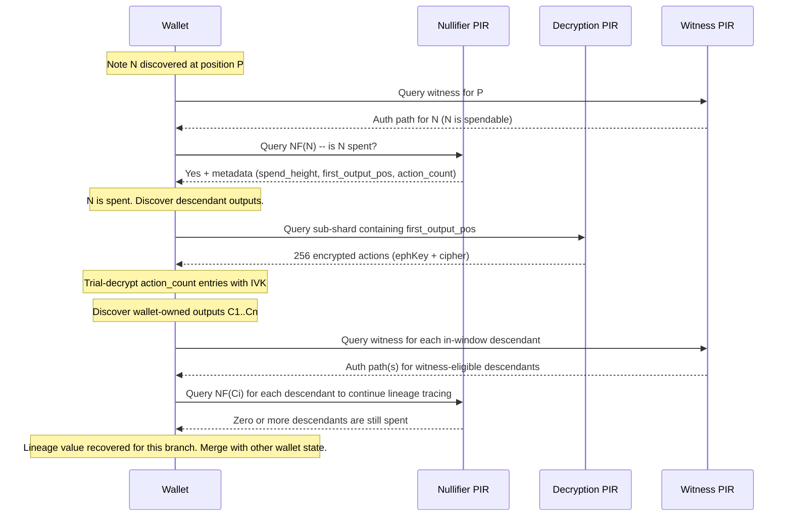

# Change Note Tracking via PIR: Design Extension

## Gap Analysis

The core intuition is **valid**, but the original claim was too broad. With both nullifier PIR and witness PIR deployed, a gap remains in the wallet's balance awareness when a detected spend has associated downstream wallet-owned outputs. A recursive design can recover value along that spent-note lineage earlier, but it does **not** by itself reconstruct total wallet balance across all independent note lineages.

### The precise gap

Consider a wallet syncing from height 1000, with a note N (value 10 ZEC) discovered at tree position P:

1. **Witness PIR** gives N a Merkle path -- N is immediately spendable.
2. **Nullifier PIR** reveals NF(N) exists -- N has been spent. Wallet subtracts 10 ZEC.
3. The spending transaction T at height H_spend created later wallet-owned output C (value 7 ZEC) at tree position Q.
4. **C cannot be discovered** until the wallet scans block H_spend and trial-decrypts the compact actions.

Result: the wallet shows a balance that is too low by C's value until sync reaches H_spend. If the user wanted to spend, they cannot -- their spendable balance appears to be zero even though 7 ZEC of replacement value exists on-chain. This is a lineage-local error; total wallet balance may also include unrelated notes that this protocol does not discover.

### When it matters

The gap is negligible when the wallet is near the tip (seconds of lag). It becomes significant in two scenarios:

- **Extended offline period**: Wallet was offline for hours/days while funds were spent and re-spent. The chain of spends creates a multi-hop dependency: N -> (spent) -> C1 -> (spent) -> C2 -> ... -> Ck (latest wallet-owned descendant). Without change tracking, the wallet cannot determine the currently relevant descendant note for that lineage until it scans through the chain sequentially.
- **Wallet restore from seed**: The oldest funded note may have been spent dozens of times over months. Each hop requires scanning to the next spend height. The user sees an incorrect or incomplete balance for the affected lineage for the entire sync duration.

### Why existing PIR systems don't cover it

The nullifier PIR only answers "is NF(N) present?" (boolean). It does not reveal which transaction spent N or where the resulting wallet-owned outputs are in the commitment tree. The witness PIR gives authentication paths for known note positions, but the wallet doesn't know a descendant note's position until it discovers the note via trial decryption. Trial decryption requires the compact action's encrypted fields (`ephemeralKey` + `ciphertext`), which are only available in compact blocks -- and downloading a specific compact block by height leaks timing information.

## Design Extension: Protocol Components Plus Wallet-State Changes

Two PIR-facing additions close the protocol gap, but they are not sufficient on their own. A usable design also needs wallet-state changes so PIR-discovered descendants can affect balances before the block scanner reaches them.

### Component 1: Extended nullifier entries (spend metadata)

Extend each nullifier hash table entry from 32 bytes to 41 bytes:

```rust
struct NullifierEntry {
    nullifier: [u8; 32],           // existing -- the nullifier itself
    spend_height: u32,             // block height where this nullifier was revealed
    first_output_position: u32,    // tree position of first Orchard output in spending tx
    action_count: u8,              // number of Orchard actions in the spending tx
}
```

**Impact on existing nullifier PIR database** (`[spend-types/src/lib.rs](spendability-pir/nullifier/spend-types/src/lib.rs)`):

- `ENTRY_BYTES`: 32 -> 41
- `BUCKET_BYTES`: 112 x 41 = 4,592 (was 3,584)
- `DB_BYTES`: 16,384 x 4,592 = ~72 MB (was ~56 MB, **+29%**)
- Rebuild time scales proportionally -- still well within 75-second block interval

**Ingest changes**: The `[nf-ingest` parser](spendability-pir/nullifier/nf-ingest/src/parser.rs) currently extracts only `action.nullifier` from each `CompactOrchardAction`. It already iterates over `block.vtx` transactions. The extension requires tracking `orchardCommitmentTreeSize` from `ChainMetadata` (already available in compact blocks) to compute each transaction's `first_output_position`, exactly as `scan_block` in `[scanning.rs](zcash_client_sqlite/zcash_client_backend/src/scanning.rs)` does:

```
orchard_tree_size_before_block = chain_meta.orchard_commitment_tree_size - sum(tx.actions.len() for tx in block.vtx)
per-tx: first_output_position = running_tree_size; running_tree_size += tx.actions.len()
```

The `ChainEvent::NewBlock` gains a `Vec<NullifierWithMeta>` instead of `Vec<[u8; 32]>`. The `HashTableDb` entry format changes accordingly -- `[Bucket](spendability-pir/nullifier/hashtable-pir/src/lib.rs)` becomes `entries: [NullifierEntry; BUCKET_CAPACITY]`, and `[scan_bucket_for_nf](spendability-pir/nullifier/spend-client/src/lib.rs)` parses 41-byte chunks, matching on the first 32 bytes and extracting metadata on match.

### Component 2: Decryption PIR database

A new PIR database, hosted by the witness server, stores the encrypted compact action data needed for trial decryption. Same sub-shard geometry as witness PIR -- different row content:

**Per leaf**: `ephemeralKey` (32 bytes) + `ciphertext` (52 bytes) = **84 bytes**
**Per row**: 256 x 84 = **21,504 bytes**
**Database**: 8,192 x 21,504 = **~168 MB**

Note: `cmx` is not stored here -- the witness PIR database already contains it. The decryption PIR stores only the two fields needed for trial decryption that the witness PIR does not carry.

**Bandwidth per query** (extrapolated from witness PIR: 8,192-byte rows give 605 KB upload + 36 KB download):

- Upload: ~620 KB (pub_params dominates, row count is the same)
- Download: ~95 KB (scales with row size: 36 x 21,504 / 8,192)
- **Total: ~715 KB per decryption query**

**Rebuild time**: ~9 seconds (extrapolated linearly from 64 MB -> 3.5s). Within the 75-second block interval but tighter than the witness PIR. Same immutability property applies: completed sub-shards never change.

**Witness server endpoints** (additions to the existing witness server):

```
GET  /decrypt-params   -- YPIR parameters for the decryption PIR engine
POST /decrypt-query    -- YPIR query against the decryption database
```

The server runs two PIR engines from the same `commitment-ingest` pipeline. Both share the same `BroadcastData` (cap + sub-shard roots), window tracking, and `ArcSwap` rebuild lifecycle.

### Component 3: Wallet provisional-state integration

Today, the wallet-side spendability flow only returns booleans and immediately inserts note IDs into `pir_spent_notes`:

```rust
struct NullifierCheckResult {
    earliest_height: u64,
    latest_height: u64,
    spent: Vec<bool>,
}
```

That is sufficient for "mark existing note spent", but not for "replace it with a later wallet-owned descendant". The recursive design therefore requires coordinated changes across the FFI, SDK, and wallet DB layers:

- **FFI/API shape**: replace the bool-only `spent: Vec<bool>` result with per-input spend metadata, including `{spent, spend_height, first_output_position, action_count}` on matches.
- **SDK orchestration**: extend the current `checkWalletSpendability` path so it does more than `insertPIRSpentNotes`. For spent notes, it must optionally fetch decryption rows, trial-decrypt wallet-owned outputs, obtain witness data when available, and persist provisional descendants.
- **Wallet DB state**: add a provisional representation for PIR-discovered descendants, instead of relying only on `pir_spent_notes`. The wallet summary must be able to subtract the original note while adding any provisional replacement notes from the same lineage.
- **Scanner reconciliation**: when normal block scanning later discovers the same output note canonically, the provisional record must be merged into the scanned record and then removed. The scanner remains the canonical source of mined transaction history.
- **Reorg behavior**: provisional PIR state must be truncated along with `pir_spent_notes` and `pir_witness_data`, because all three are ahead-of-scan hints rather than canonical chain history.

### Tree decomposition with the new database

```
Depth 0 (root)
  |
  | Broadcast -- cap (shard roots array, ~24 KB)
  |
Depth 16 (shard roots)
  |
  | Broadcast -- sub-shard roots (~80-256 KB)
  |
Depth 24 (sub-shard roots)
  |
  | Witness PIR: 256 x cmx (32 B) = 8 KB/row, 64 MB total
  | Decryption PIR: 256 x (ephKey + cipher) (84 B) = 21 KB/row, 168 MB total
  |
Depth 32 (note commitments)
```

## Recursive Change Discovery Protocol




**Step-by-step detail:**

1. **Nullifier PIR query** for NF(N): client retrieves the 4,592-byte bucket, scans 41-byte entries for NF(N), extracts `{spend_height, first_output_pos, action_count}`.
2. **Compute sub-shard index**: `shard = first_output_pos >> 16`, `subshard = (first_output_pos >> 8) & 0xFF`. Compute physical PIR row from broadcast's `window_start_shard`.
3. **Decryption PIR query** for that sub-shard row: receive 256 encrypted actions (each 84 bytes).
4. **Extract outputs**: the `action_count` entries starting at `leaf_index = first_output_pos & 0xFF`. If the transaction straddles a sub-shard boundary (1/256 chance), issue a second decryption PIR query for the next sub-shard.
5. **Trial-decrypt** each extracted entry using the wallet's Orchard IVK. This is the standard compact trial decryption (Pallas DH + ChaCha20, a few microseconds per attempt). At most `action_count` attempts (typically 2-4).
6. **Discovered wallet-owned outputs**: the wallet may find zero, one, or multiple outputs it can decrypt. For each matching output `Ci`, it learns the value, diversifier, memo prefix, and tree position `Qi = first_output_pos + action_index_within_tx`.
7. **Witness PIR query** for each `Qi` that lies inside the witness window: obtain the authentication path, verify against the anchor root, and store it with the provisional descendant. If `Qi` is outside the window, the note can still be recorded as a provisional descendant but is not yet spendable via PIR witness.
8. **Recurse per descendant**: query nullifier PIR for each `NF(Ci)`. If a descendant is itself spent, repeat from step 1 with that descendant as the next lineage node. If not spent, that descendant is the latest known wallet-owned note for that branch.
9. **Merge with wallet state**: add all latest-known descendants from this lineage into provisional balance state. This recovers value for the affected branch earlier, but total wallet balance still requires merging with all other known notes and any unrelated lineages the scanner has not discovered yet.

## Current wallet behavior that this design must change

The present SDK and DB integration is intentionally simpler than the recursive design:

- [zcash-swift-wallet-sdk/rust/src/spendability.rs](zcash-swift-wallet-sdk/rust/src/spendability.rs) returns a bool-only result, parallel to the input nullifier list.
- [zcash-swift-wallet-sdk/Sources/ZcashLightClientKit/Synchronizer/SDKSynchronizer.swift](zcash-swift-wallet-sdk/Sources/ZcashLightClientKit/Synchronizer/SDKSynchronizer.swift) turns those booleans into `spentNoteIds` and writes them to the database through `insertPIRSpentNotes`.
- [zcash_client_sqlite/zcash_client_sqlite/src/wallet/common.rs](zcash_client_sqlite/zcash_client_sqlite/src/wallet/common.rs) immediately excludes `pir_spent_notes` from wallet summary queries, which means balance drops before replacement notes exist locally.

Current spendability path:

```swift
let spentNotes = zip(notes, checkResult.spent).filter { $0.1 }
let spentNoteIds = spentNotes.map(\.0.id)

if !spentNoteIds.isEmpty {
    try await initializer.rustBackend.insertPIRSpentNotes(spentNoteIds)
}
```

Current wallet-summary exclusion:

```rust
#[cfg(feature = "spendability-pir")]
if table_prefix == "orchard" {
    return format!("{base} UNION SELECT note_id FROM pir_spent_notes");
}
```

That behavior explains the current UX problem: PIR can subtract known notes ahead of scan, but it has no place to add provisional descendants until compact-block scanning catches up.

## Wallet provisional-state model

To make recursive change discovery affect balances correctly, the wallet needs an explicit provisional state machine for PIR-discovered descendants.

### Proposed lifecycle

1. **Detect spend**: nullifier PIR marks an existing tracked note as spent and returns spend metadata.
2. **Discover descendants**: decryption PIR and local trial decryption identify zero or more wallet-owned outputs from the spending transaction.
3. **Persist provisional descendants**: each discovered descendant is stored in a PIR-specific provisional table with its lineage parent, mined height, value, position, and witness status.
4. **Expose provisional balance**: wallet summary logic subtracts the original note via `pir_spent_notes` and adds the latest provisional descendants for that lineage.
5. **Confirm by scanning**: when the block scanner later discovers the same output canonically, it merges the provisional row into the canonical received-note record and removes the provisional row.
6. **Clear on truncate/reorg**: if the wallet truncates to an earlier height, provisional descendants are deleted together with other PIR-derived artifacts.

### Recommended provisional schema

The document should go one step further and recommend a concrete shape for provisional descendant storage. A dedicated table is the cleaner design:

```sql
pir_provisional_orchard_notes (
    id INTEGER PRIMARY KEY,
    account_id INTEGER NOT NULL,
    parent_note_id INTEGER NOT NULL,
    lineage_root_note_id INTEGER NOT NULL,
    mined_height INTEGER NOT NULL,
    commitment_tree_position INTEGER NOT NULL,
    value INTEGER NOT NULL,
    is_change INTEGER,
    recipient_key_scope INTEGER,
    nf BLOB,
    rho BLOB,
    rseed BLOB,
    diversifier BLOB,
    memo_prefix BLOB,
    witness_state TEXT NOT NULL,
    discovered_via_pir_at INTEGER NOT NULL
)
```

Recommended invariants:

- `parent_note_id` links the row to the note whose spend exposed this descendant.
- `lineage_root_note_id` makes it easy to collapse the lineage to its latest provisional leaves for balance queries.
- `commitment_tree_position` is the primary merge key with later scanner output, because the scanner should eventually discover the same Orchard output at the same canonical position.
- `witness_state` should at minimum distinguish `missing`, `available`, and `outside_window`.
- A uniqueness constraint on `commitment_tree_position` avoids duplicate inserts when startup PIR and later manual PIR runs rediscover the same descendant.

This should remain a dedicated table rather than extending `orchard_received_notes`, because merge, truncation, and reorg semantics are materially different from canonical scanned notes.

### Merge and balance rules

The plan should also spell out exactly how provisional rows participate in accounting:

1. Insert the original spent note into `pir_spent_notes` exactly as today.
2. Insert zero or more rows into `pir_provisional_orchard_notes`.
3. For balance purposes, add only the **latest known unspent provisional leaves** per lineage root; do not add intermediate descendants that are themselves already marked spent by recursive PIR.
4. When scanning later inserts a canonical `orchard_received_notes` row at the same `commitment_tree_position`, delete the provisional row in the same transaction.
5. If scanning later records the spend of that canonical note, normal `orchard_received_note_spends` takes over and the lineage exits provisional state naturally.

The safest first implementation is to include provisional descendants directly in the main wallet summary, but keep a UI/debug surface that can still show "recovered ahead of scan" notes separately. That preserves balance correctness while keeping observability.

### Properties of the provisional model

- It keeps the **scanner** as the canonical source of full transaction history.
- It lets the wallet show **earlier recovered value** for affected lineages without pretending that the full wallet history has already been scanned.
- It avoids overloading `pir_spent_notes`, whose current semantics are only "this already-known note has been observed spent".
- It gives the SDK a clean place to represent partial success, such as "the note is spent, a descendant was found, but no witness is available yet".

## Failure Boundaries and Fallback Policy

The recursive protocol should be explicitly bounded. When any of the following conditions occur, the client should stop recursing for that branch and fall back to normal compact-block scanning:

- **No wallet-owned outputs decrypt**: the spending transaction may have no wallet-owned descendants, or the wallet may lack the keys needed to decrypt them.
- **Multiple wallet-owned outputs decrypt**: recurse across all matching descendants, not just one assumed "change note". This covers self-send, shielding, and other multi-output cases.
- **Witness outside configured window**: the witness client rejects positions outside its configured shard window. In that case, the descendant can be recorded as provisional-but-not-spendable, and normal scanning must supply the witness later.
- **Nullifier aged out of retention window**: the nullifier database evicts oldest blocks to remain under `TARGET_SIZE`. Once a historical spend falls out of retention, PIR can no longer prove that hop and the client must rely on scanning.
- **Cross-sub-shard transaction**: when outputs straddle a sub-shard boundary, issue the second decryption query if still within policy; otherwise stop and fall back.
- **Deep chains**: for long historical chains, scanning may become cheaper or simpler than repeated recursive PIR lookups. The client should have a threshold where it stops recursion and waits for the scanner.

These fallbacks are not edge-case implementation details; they are part of the design contract. The protocol provides earlier recovery when data is available, not a guarantee that every historical lineage can be reconstructed entirely through PIR.

Relevant existing limits:

```rust
if shard_idx < self.broadcast.window_start_shard || shard_idx >= window_end {
    return Err(WitnessClientError::PositionOutsideWindow(
        position,
        self.broadcast.window_start_shard,
        window_end,
    ));
}
```

```rust
pub fn evict_to_target(&mut self) {
    while self.num_entries > spend_types::TARGET_SIZE {
        if self.evict_oldest_block().is_none() {
            break;
        }
    }
}
```

## Privacy Analysis

No information leaks at any step:

- **Nullifier PIR** (step 1): YPIR guarantees the server cannot distinguish which of the 16,384 bucket rows was queried. The server learns nothing about which nullifier was checked.
- **Decryption PIR** (step 3): YPIR guarantees the server cannot distinguish which of the 8,192 sub-shard rows was queried. The server learns nothing about which output positions interest the wallet.
- **Trial decryption** (step 5): Entirely local. Only the wallet's IVK can decrypt its own notes. The server never sees the decrypted note data.
- **Witness PIR** (step 7): Same YPIR privacy as for any other witness query.
- **Query pattern**: The server sees that "a client made a nullifier query, then a decryption query, then maybe one or more witness queries." This pattern is shared across wallets using the feature, but the number of hops and the presence of fallback still leak bounded behavioral information.

The server learns the total number of recursive hops and can infer whether the client stopped early or fell back to scanning. That does not reveal specific note values, positions, or identity, but it should be treated as residual timing metadata rather than ignored.

## Cost Analysis

**Per recursive hop (3 round trips):**


| Query             | Upload      | Download                | Server time |
| ----------------- | ----------- | ----------------------- | ----------- |
| Nullifier PIR     | ~3.3 MB     | included                | ~1.5s       |
| Decryption PIR    | ~620 KB     | ~95 KB                  | ~150ms      |
| Witness PIR       | ~605 KB     | ~36 KB                  | ~96ms       |
| **Total per hop** | **~4.5 MB** | **~131 KB + broadcast** | **~1.75s**  |


**Practical chain depths:**


| Scenario                             | Typical hops | Total bandwidth | Wall time |
| ------------------------------------ | ------------ | --------------- | --------- |
| Offline 1 hour, 1 interim spend      | 1            | ~4.6 MB         | ~2s       |
| Offline 1 day, 3 interim spends      | 3            | ~14 MB          | ~6s       |
| Offline 1 week, 10 spends            | 10           | ~46 MB          | ~18s      |
| Wallet restore, 50 historical spends | 50           | ~230 MB         | ~90s      |


For comparison: scanning 6 months of compact blocks from lightwalletd is ~60 MB of data but takes much longer due to trial decryption overhead on every action. The recursive approach is bandwidth-heavier per-hop but much faster in wall time because it only trial-decrypts a handful of actions (the spending transaction's outputs, typically 2-4) rather than all actions in all blocks.

**Server resource impact:**


| Resource                  | Witness PIR alone | + Decryption PIR      |
| ------------------------- | ----------------- | --------------------- |
| PIR databases             | 64 MB             | 64 + 168 = 232 MB     |
| Rebuild time per block    | ~3.5s             | ~3.5 + ~9 = ~12.5s    |
| Memory (PIR state + data) | ~131 MB           | ~131 + ~340 = ~471 MB |


Rebuilds can run in parallel (two independent `PirEngine` instances on separate threads). Combined wall time is ~9 seconds (the larger database dominates), not the sum.

## Optimizations for Deep Chains

For wallet restore with many hops, the naive sequential protocol is bandwidth-intensive. Several optimizations reduce cost:

- **Pipelining**: While waiting for the decryption PIR response for hop k, issue the nullifier PIR query for the previous hop's descendant note. Overlaps latency but not bandwidth.
- **Batch decryption**: If multiple outputs from different hops fall in the same sub-shard (likely when transactions are close in time), a single decryption PIR query serves multiple hops.
- **Early termination**: If the wallet only needs to improve near-term balance fidelity, it can stop recursing once it has recovered enough lineage-local value. It does not need to trace every historical branch.
- **Hybrid approach**: For deep chains (>10 hops), it may be faster to scan compact blocks for the relevant height range directly from lightwalletd. The recursive PIR approach is most valuable for shallow chains (1-5 hops) where it provides instant results.

## Relationship to V1

This extension is **post-V1 scope**. The V1 implementation (witness PIR server + client, as described in the existing plan) must be validated end-to-end before adding change tracking. The V1 design decisions enable this extension cleanly:

- The `commitment-ingest` pipeline already processes all four `CompactOrchardAction` fields (`nullifier`, `cmx`, `ephemeralKey`, `ciphertext`). V1 uses only `cmx`; the extension uses `ephemeralKey` + `ciphertext` for the decryption PIR, and the nullifier metadata extraction reuses the same per-transaction tree-size accounting.
- The witness server architecture (multiple PIR engines, shared broadcast, `ArcSwap` state) directly accommodates a second PIR database.
- The `NullifierEntry` extension in the nullifier hash table is a format version bump -- the snapshot format already has a version field, and the client-side `scan_bucket_for_nf` parameterizes on `ENTRY_BYTES`.
- The recursive protocol composes the existing nullifier PIR client, the new decryption PIR client, and the existing witness PIR client, but the wallet-facing FFI and DB APIs do need extension because the current spendability path is bool-only and spent-note-only.

## Open Questions

- **action_count cap**: Orchard transactions typically have 2 actions (minimum due to dummy padding). Should the entry format use a fixed max (e.g., cap `action_count` at 16 and truncate) to keep entries small, or use the actual count? Transactions with >16 actions are extremely rare on mainnet and the wallet can fall back to scanning for those.
- **Cross-sub-shard transactions**: When a transaction's outputs straddle a sub-shard boundary (first_output_pos % 256 + action_count > 256), the client needs two decryption PIR queries. This is a 1/256 edge case. Worth handling but not optimizing.
- **Decryption PIR in combined server**: The combined server would run three PIR engines (nullifier, witness, decryption). Memory budget ~471 MB is reasonable for a server but worth benchmarking.
- **Merge key robustness**: is `commitment_tree_position` alone sufficient as the provisional-to-canonical merge key, or should the wallet also persist a cross-check field such as `cmx` once witness data is available?
- **Encrypted field retention**: should the wallet store only decrypted note material for provisional descendants, or also cache the raw PIR decryption payload for debugging and replay during development?

