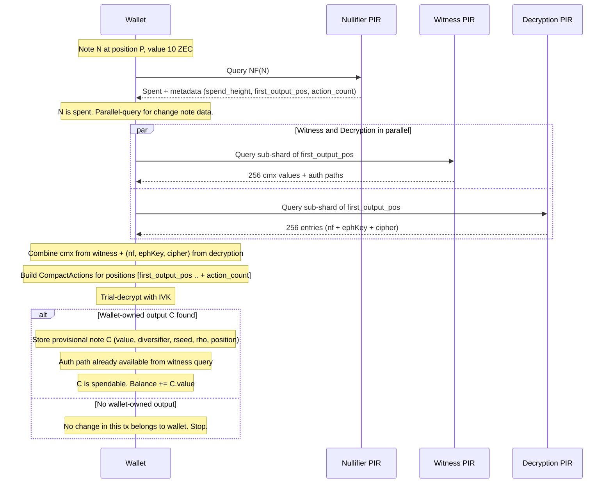

# Change Note Tracking: Implementation Plan (Depth-1)

## Scope

Depth-1 change discovery only: when PIR detects a note as spent, discover its immediate change note(s) from the spending transaction via decryption PIR and trial decryption. No multi-hop recursion -- that is deferred. Provisional notes are spendable if a PIR witness is available.

No lightwalletd scan hints -- the privacy leak of downloading specific blocks is unacceptable.

## Technical correction from original design

The original plan sizes decryption PIR entries at 84 bytes (ephemeralKey + ciphertext). This is insufficient. `CompactAction::from_parts` requires the action's nullifier as `rho` for note reconstruction:

```190:197:zcash_client_sqlite/zcash_client_backend/src/proto.rs
    fn try_from(value: &compact_formats::CompactOrchardAction) -> Result<Self, Self::Error> {
        Ok(orchard::note_encryption::CompactAction::from_parts(
            value.nf()?,
            value.cmx()?,
            value.ephemeral_key()?,
            value.ciphertext[..].try_into().map_err(|_| ())?,
        ))
    }
```

Without `nf` (used as `rho` for the output note), the wallet cannot reconstruct the note, derive its nullifier, or verify its commitment. `cmx` can come from the witness PIR (queried in parallel), but `nf` must be in the decryption PIR.

Corrected entry: **116 bytes** (nf: 32 + ephemeralKey: 32 + ciphertext: 52).

## Corrected sizing


|                       | Original plan (84 B/leaf) | Corrected (116 B/leaf) |
| --------------------- | ------------------------- | ---------------------- |
| Per row (256 leaves)  | 21,504 B                  | 29,696 B               |
| Database (8,192 rows) | ~168 MB                   | ~232 MB                |
| Download per query    | ~95 KB                    | ~130 KB                |
| Upload per query      | ~620 KB                   | ~620 KB                |


Combined server memory (nullifier + witness + decryption): ~530 MB steady-state. Peak during rebuild: ~1 GB.

## Protocol flow (depth-1)




Key optimization: the witness and decryption PIR queries target the same sub-shard and run in **parallel**. The witness response provides both `cmx` (needed for trial decryption verification) and the authentication path (needed for spending). Total wall time for the parallel pair: ~150ms (the slower of the two).

Total per depth-1 discovery: **1 nullifier query (~~1.5s) + 1 parallel pair (~~150ms) = ~1.7s wall time, ~4.5 MB bandwidth**.

## Component 1: Extended nullifier entries

Extend each entry from 32 to 41 bytes, as in the original plan:

```rust
struct NullifierEntry {
    nullifier: [u8; 32],
    spend_height: u32,
    first_output_position: u32,
    action_count: u8,
}
```

Files to change:

- [spend-types/src/lib.rs](spendability-pir/nullifier/spend-types/src/lib.rs): `ENTRY_BYTES` 32 -> 41, add `NullifierEntry` struct, update `BUCKET_BYTES`/`DB_BYTES`
- [nf-ingest/src/parser.rs](spendability-pir/nullifier/nf-ingest/src/parser.rs): extract per-tx output position using `orchardCommitmentTreeSize` from `ChainMetadata` (same accounting as [scanning.rs](zcash_client_sqlite/zcash_client_backend/src/scanning.rs) line 807-819). Return `Vec<NullifierWithMeta>` instead of `Vec<[u8; 32]>`
- [hashtable-pir/src/lib.rs](spendability-pir/nullifier/hashtable-pir/src/lib.rs): `Bucket` entries become `[NullifierEntry; BUCKET_CAPACITY]`, update `to_pir_bytes`/`insert`/snapshot format
- [spend-client/src/lib.rs](spendability-pir/nullifier/spend-client/src/lib.rs): `scan_bucket_for_nf` parses 41-byte chunks, matches on first 32 bytes, returns `Option<SpendMetadata>` on match

DB impact: ~72 MB (+29% from ~56 MB). Rebuild time scales proportionally -- still within block interval.

## Component 2: Decryption PIR database

A new PIR database stored and served by the witness/combined server. Same sub-shard geometry as witness PIR, different row content.

**Per leaf (116 bytes):**

- `nullifier`: 32 bytes (the action's nullifier, used as `rho`)
- `ephemeral_key`: 32 bytes
- `ciphertext`: 52 bytes (first 52 bytes of `enc_ciphertext`)

Note: `cmx` is NOT stored -- it comes from the existing witness PIR database.

**Extraction:** The current `extract_commitments` in [commitment-ingest/src/parser.rs](spendability-pir/witness/commitment-ingest/src/parser.rs) only extracts `cmx`. Add a parallel extractor that produces `Vec<DecryptionLeaf>` (nf + ephKey + ciphertext) from the same `CompactOrchardAction` fields. Both extractors iterate the same `block.vtx` -- they can share the loop or run as two passes.

**Server endpoints** (additions to witness/combined server):

```
GET  /decrypt-params   -- YPIR scenario for decryption PIR
POST /decrypt-query    -- YPIR query against decryption database
```

The server runs a second `PirEngine` alongside the witness engine, sharing the same `ArcSwap` rebuild lifecycle, sub-shard window tracking, and broadcast data.

## Component 3: Decryption PIR client

New crate or module alongside [witness-client](spendability-pir/witness/witness-client/src/lib.rs). Same YPIR query pattern:

1. Fetch `/decrypt-params` -> build `YPIRClient`
2. Compute sub-shard index from `first_output_position` (same as witness client: `shard = pos >> 16`, `subshard = (pos >> 8) & 0xFF`)
3. Generate YPIR query for the sub-shard row
4. Decode response -> 256 x 116-byte entries
5. Extract entries at leaf indices `[first_output_pos & 0xFF .. + action_count]`
6. Pair with `cmx` values from witness PIR response at the same indices
7. Build `CompactAction::from_parts(nf, cmx, ephemeral_key, ciphertext)` for each
8. Run `try_compact_note_decryption` with wallet IVK
9. For matches: extract diversifier, value, rseed. Compute `rho = nf` from the action. Derive the note's own nullifier from (rseed, rho, position, spending_key).

Cross-sub-shard case: if `(first_output_pos & 0xFF) + action_count > 256`, issue a second decryption query (and second witness query) for the next sub-shard. Probability: `(action_count - 1) / 256`.

## Component 4: Provisional notes in wallet DB

New table:

```sql
CREATE TABLE pir_provisional_notes (
    id INTEGER PRIMARY KEY,
    account_id INTEGER NOT NULL REFERENCES accounts(id),
    spent_note_id INTEGER NOT NULL,
    value INTEGER NOT NULL,
    position INTEGER NOT NULL,
    diversifier BLOB NOT NULL,
    rseed BLOB NOT NULL,
    rho BLOB NOT NULL,
    nullifier BLOB NOT NULL,
    spend_height INTEGER NOT NULL,
    has_pir_witness INTEGER NOT NULL DEFAULT 0
);
```

- `spent_note_id`: the original `orchard_received_notes.id` that was spent (links lineage)
- `nullifier`: the provisional note's own nullifier (needed for coin selection and future spend detection)
- `has_pir_witness`: set to 1 when witness PIR returns a valid auth path for this position

**Balance integration** ([wallet/common.rs](zcash_client_sqlite/zcash_client_sqlite/src/wallet/common.rs), [wallet.rs](zcash_client_sqlite/zcash_client_sqlite/src/wallet.rs)):

The existing `get_wallet_summary` computes balance from `orchard_received_notes` minus `spent_notes_clause`. Provisional notes need to be added in. Two options:

- **(Preferred) Add provisional value in `with_pool_balances`:** After the main note loop, query `pir_provisional_notes` for the account. For each provisional note: if `has_pir_witness = 1`, add to `spendable_value`; otherwise add to `value_pending_spendability`.
- This keeps the canonical note query unchanged and adds provisional value as a supplement.

**Coin selection** ([wallet/common.rs](zcash_client_sqlite/zcash_client_sqlite/src/wallet/common.rs) `select_unspent_notes`): UNION provisional notes with `has_pir_witness = 1` into the spendable note set. These notes need to carry the same fields as canonical notes for `create_proposed_transactions` to build the spend.

**Scanner reconciliation:** When `put_received_note` in [wallet/orchard.rs](zcash_client_sqlite/zcash_client_sqlite/src/wallet/orchard.rs) inserts a canonically-scanned note at a position matching a provisional note, delete the provisional row. Match on `position` (tree position is unique and deterministic).

**Truncation:** Add `DELETE FROM pir_provisional_notes` alongside the existing `DELETE FROM pir_spent_notes` and `DELETE FROM pir_witness_data` in `truncate_to_height` ([wallet.rs](zcash_client_sqlite/zcash_client_sqlite/src/wallet.rs) line ~3362).

## Component 5: SDK orchestration

The current flow in [SDKSynchronizer.swift](zcash-swift-wallet-sdk/Sources/ZcashLightClientKit/Synchronizer/SDKSynchronizer.swift) `checkWalletSpendability`:

```swift
let checkResult = try await ... checkNullifiersPIR(...)
let spentNotes = zip(notes, checkResult.spent).filter { $0.1 }
let spentNoteIds = spentNotes.map(\.0.id)
try await initializer.rustBackend.insertPIRSpentNotes(spentNoteIds)
```

Extended flow:

1. **Nullifier PIR** returns `Vec<Option<SpendMetadata>>` instead of `Vec<bool>`. `SpendMetadata = { spend_height, first_output_position, action_count }`.
2. For each spent note with metadata: **parallel-query** witness PIR and decryption PIR for the sub-shard containing `first_output_position`.
3. **Trial-decrypt** the relevant actions. This happens in Rust (new FFI function or extended existing one).
4. For discovered wallet-owned outputs: **store provisional note** + **store PIR witness** if available.
5. Continue with `insertPIRSpentNotes` for the original spent notes (unchanged).

FFI changes:

- [spendability.rs](zcash-swift-wallet-sdk/rust/src/spendability.rs): `NullifierCheckResult.spent` becomes `Vec<Option<SpendMetadata>>`. Add a new FFI function for the combined "decrypt + store provisional" step, or extend the existing `checkNullifiersPIR` to handle the full flow internally.
- [witness.rs](zcash-swift-wallet-sdk/rust/src/witness.rs): The existing witness fetch logic can be reused for the parallel witness query.

## Reorg safety

Provisional notes share the same reorg contract as `pir_spent_notes` and `pir_witness_data`: they are ahead-of-scan hints, not canonical chain history. On truncation, all three are cleared unconditionally. This is safe because:

- The scanner will re-discover any legitimate notes during rescan
- PIR checks will re-detect spends after the new chain stabilizes
- No user funds are lost -- only the ahead-of-scan optimization is temporarily removed

Spending a provisional note that is later invalidated by a reorg: the spending transaction itself would also be invalidated, so no funds are lost. The wallet would need to re-create the transaction after rescan. This is the same risk as spending any unconfirmed note and is acceptable per the depth requirement.

## What this defers

- **Recursion (depth > 1):** If the change note C is itself spent, the wallet does not discover C's descendant in this implementation. It waits for the scanner to catch up, or for a future recursive extension.
- **Pipelining / batch optimization:** No attempt to overlap queries across multiple spent notes or hops.
- **Deep chain threshold:** No policy for when PIR discovery is more expensive than scanning.
- **Scan hints:** The `spend_height` metadata is available in the extended nullifier entry but is not used to prioritize scanning (privacy concern). It could be used in the future if the threat model changes.

