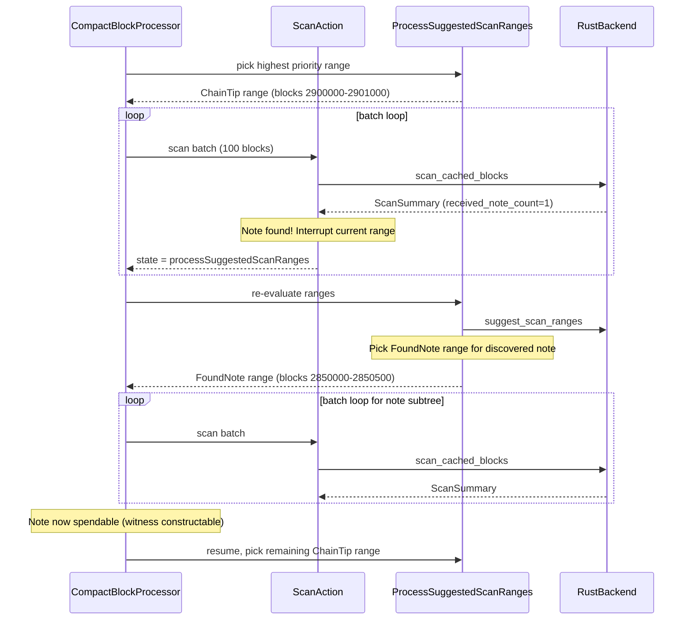

# Parallel Per-Note Witness Scanning: Feasibility Analysis

## Why per-note threads won't work

There are three hard constraints that prevent parallel `scan_cached_blocks` calls on different ranges:

### 1. The commitment tree must be built sequentially

`scan_cached_blocks` updates the note commitment shard tree as it processes blocks. Two concurrent scans writing to different positions in the same tree would produce an inconsistent state. The Rust FFI docs are explicit: **"Scanned blocks are required to be height-sequential."**

### 2. SQLite is single-writer

The wallet DB is a single SQLite file. SQLite allows concurrent readers but only **one writer** at a time. `scan_cached_blocks` writes notes, nullifiers, witnesses, and tree state in one transaction. Two parallel scan-writers would serialize at the SQLite lock anyway, gaining no parallelism and risking deadlocks.

### 3. Swift enforces serialization via `@DBActor`

All Rust DB operations (`scanBlocks`, `getWalletSummary`, `suggestScanRanges`, etc.) run on a shared `@globalActor` (`DBActor`), which serializes them. Even if the Rust layer could handle it, Swift won't dispatch two `scanBlocks` calls concurrently.

### 4. `&mut db_data` exclusive borrow

Each `scan_cached_blocks` call takes `&mut WalletDb`, an exclusive reference. While separate FFI calls open separate connections (so Rust's borrow checker isn't the barrier), the upstream crate (`zcash_client_sqlite` 0.19) assumes exclusive write access within a scan call.

## What IS feasible: scan reordering (not parallelism)

The real bottleneck is **scan order**, not throughput. Currently:

```
ChainTip range (priority 50) scanned fully
  -> note discovered at old height
  -> FoundNote range created (priority 40)
  -> but ChainTip range hasn't finished yet
  -> SDK keeps scanning ChainTip until done
  -> THEN picks up FoundNote range
  -> note finally becomes spendable
```

The 30s-1min delay is the time to finish the ChainTip range PLUS download+scan the FoundNote range.

### Approach: Interrupt-and-reorder after note discovery

After each 100-block scan batch, detect whether new notes were found. If so, **suspend** the current range and immediately switch to scanning the discovered note's subtree. Once the note's witness is constructable (spendable), resume the original range.

This stays within all the constraints (single sequential scanner) but dramatically reduces time-to-spendable.

#### Where to implement

The change spans two layers:

**A. `ScanAction` ([ScanAction.swift](zcash-swift-wallet-sdk/Sources/ZcashLightClientKit/Block/Actions/ScanAction.swift))**

After `blockScanner.scanBlocks(at: batchRange)` returns, check if any new notes were found (the `ScanSummary` from Rust already reports `received_note_count`). If > 0, instead of continuing to `clearAlreadyScannedBlocks`, transition to a new state that triggers re-evaluation of scan ranges for the note's subtree.

**B. `ProcessSuggestedScanRangesAction` ([ProcessSuggestedScanRangesAction.swift](zcash-swift-wallet-sdk/Sources/ZcashLightClientKit/Block/Actions/ProcessSuggestedScanRangesAction.swift))**

Currently always picks `scanRanges.first` (highest priority). Modify to prefer `FoundNote` ranges (priority 40) over remaining `ChainTip` ranges (priority 50) when the goal is fastest-to-spendable. Or: add an "urgent note" mode that re-queries scan ranges and picks the one covering the found note.

**C. `scan_cached_blocks` return value ([ffi.rs](zcash-swift-wallet-sdk/rust/src/ffi.rs))**

`ScanSummary` already exposes `received_note_count` and `spent_note_count` across FFI. This is the signal to trigger the interrupt.




### Why PIR does NOT help here

PIR solves a different problem. It answers "has this nullifier been revealed on-chain?" — whether a note is **spent**. The 30s-1min delay is caused by missing **witness data** (Merkle authentication paths in the note commitment tree), not missing nullifier information.

The PIR overlay in `WalletBalancesStore` promotes `valuePendingSpendability` into the displayed spendable balance, but this is a **UI-level** adjustment only. If the user actually tried to spend during that window, `propose_transfer` would fail or skip the note because the Rust wallet cannot produce a witness for it — regardless of what PIR says about the nullifier.

These are orthogonal concerns:

- **PIR**: "Is this note spent?" (nullifier presence) — affects balance display accuracy
- **Witness construction**: "Can we build a valid spend proof?" (commitment tree completeness) — affects actual spendability

## Recommendation

The interrupt-and-reorder approach is the only way to reduce time-to-spendable for discovered notes. It requires no changes to the Rust crates, respects all concurrency constraints, and the signal (`received_note_count > 0` in `ScanSummary`) is already available across FFI. The main cost is added complexity in the CBP state machine to track interrupted ranges and resume them.