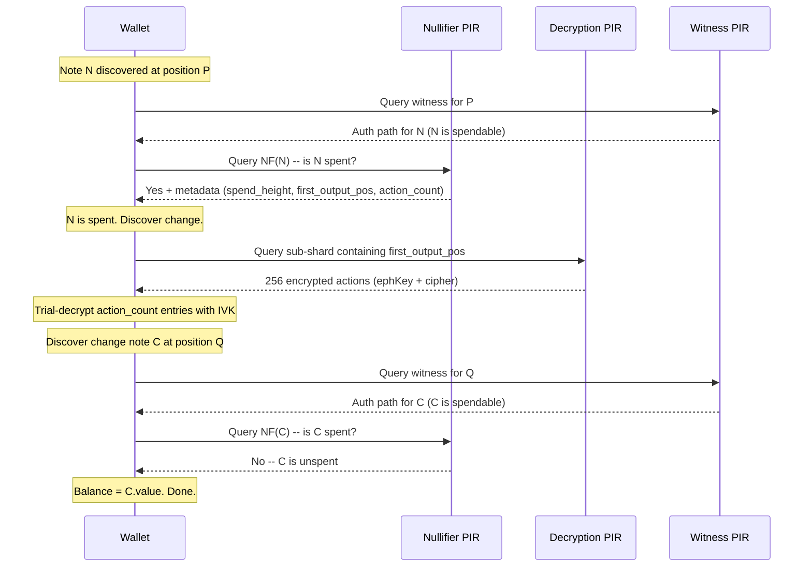

# Change Note Tracking via PIR: Design Extension

## Gap Analysis

The claim is **valid**. With both nullifier PIR and witness PIR deployed, a gap remains in the wallet's balance awareness when a detected spend has associated change.

### The precise gap

Consider a wallet syncing from height 1000, with a note N (value 10 ZEC) discovered at tree position P:

1. **Witness PIR** gives N a Merkle path -- N is immediately spendable.
2. **Nullifier PIR** reveals NF(N) exists -- N has been spent. Wallet subtracts 10 ZEC.
3. The spending transaction T at height H_spend created output notes, including change note C (value 7 ZEC) at tree position Q.
4. **C cannot be discovered** until the wallet scans block H_spend and trial-decrypts the compact actions.

Result: the wallet shows a balance that is too low by C's value until sync reaches H_spend. If the user wanted to spend, they cannot -- their spendable balance appears to be zero even though 7 ZEC of change exists on-chain.

### When it matters

The gap is negligible when the wallet is near the tip (seconds of lag). It becomes significant in two scenarios:

- **Extended offline period**: Wallet was offline for hours/days while funds were spent and re-spent. The chain of spends creates a multi-hop dependency: N -> (spent) -> C1 -> (spent) -> C2 -> ... -> Ck (unspent, actual balance). Without change tracking, the wallet cannot determine its actual balance or spend until it scans through the entire chain sequentially.
- **Wallet restore from seed**: The oldest funded note may have been spent dozens of times over months. Each hop requires scanning to the next spend height. The user sees an incorrect balance for the entire sync duration.

### Why existing PIR systems don't cover it

The nullifier PIR only answers "is NF(N) present?" (boolean). It does not reveal which transaction spent N or where the resulting outputs are in the commitment tree. The witness PIR gives authentication paths for known note positions, but the wallet doesn't know the change note's position until it discovers the note via trial decryption. Trial decryption requires the compact action's encrypted fields (`ephemeralKey` + `ciphertext`), which are only available in compact blocks -- and downloading a specific compact block by height leaks timing information.

## Design Extension: Two Components

Two additions close the gap while preserving full privacy:

### Component 1: Extended nullifier entries (spend metadata)

Extend each nullifier hash table entry from 32 bytes to 41 bytes:

```rust
struct NullifierEntry {
    nullifier: [u8; 32],           // existing -- the nullifier itself
    spend_height: u32,             // block height where this nullifier was revealed
    first_output_position: u32,    // tree position of first Orchard output in spending tx
    action_count: u8,              // number of Orchard actions in the spending tx
}
```

**Impact on existing nullifier PIR database** (`[spend-types/src/lib.rs](sync-nullifier-pir/nullifier/spend-types/src/lib.rs)`):

- `ENTRY_BYTES`: 32 -> 41
- `BUCKET_BYTES`: 112 x 41 = 4,592 (was 3,584)
- `DB_BYTES`: 16,384 x 4,592 = ~72 MB (was ~56 MB, **+29%**)
- Rebuild time scales proportionally -- still well within 75-second block interval

**Ingest changes**: The `[nf-ingest` parser](sync-nullifier-pir/nullifier/nf-ingest/src/parser.rs) currently extracts only `action.nullifier` from each `CompactOrchardAction`. It already iterates over `block.vtx` transactions. The extension requires tracking `orchardCommitmentTreeSize` from `ChainMetadata` (already available in compact blocks) to compute each transaction's `first_output_position`, exactly as `scan_block` in `[scanning.rs](zcash_client_sqlite/zcash_client_backend/src/scanning.rs)` does:

```
orchard_tree_size_before_block = chain_meta.orchard_commitment_tree_size - sum(tx.actions.len() for tx in block.vtx)
per-tx: first_output_position = running_tree_size; running_tree_size += tx.actions.len()
```

The `ChainEvent::NewBlock` gains a `Vec<NullifierWithMeta>` instead of `Vec<[u8; 32]>`. The `HashTableDb` entry format changes accordingly -- `[Bucket](sync-nullifier-pir/nullifier/hashtable-pir/src/lib.rs)` becomes `entries: [NullifierEntry; BUCKET_CAPACITY]`, and `[scan_bucket_for_nf](sync-nullifier-pir/nullifier/spend-client/src/lib.rs)` parses 41-byte chunks, matching on the first 32 bytes and extracting metadata on match.

### Component 2: Decryption PIR database

A new PIR database, hosted by the witness server, stores the encrypted compact action data needed for trial decryption. Same sub-shard geometry as witness PIR -- different row content:

**Per leaf**: `ephemeralKey` (32 bytes) + `ciphertext` (52 bytes) = **84 bytes**
**Per row**: 256 x 84 = **21,504 bytes**
**Database**: 8,192 x 21,504 = **~168 MB**

Note: `cmx` is not stored here -- the witness PIR database already contains it. The decryption PIR stores only the two fields needed for trial decryption that the witness PIR does not carry.

**Bandwidth per query** (extrapolated from witness PIR: 8,192-byte rows give 605 KB upload + 36 KB download):

- Upload: ~620 KB (pub_params dominates, row count is the same)
- Download: ~95 KB (scales with row size: 36 x 21,504 / 8,192)
- **Total: ~715 KB per decryption query**

**Rebuild time**: ~9 seconds (extrapolated linearly from 64 MB -> 3.5s). Within the 75-second block interval but tighter than the witness PIR. Same immutability property applies: completed sub-shards never change.

**Witness server endpoints** (additions to the existing witness server):

```
GET  /decrypt-params   -- YPIR parameters for the decryption PIR engine
POST /decrypt-query    -- YPIR query against the decryption database
```

The server runs two PIR engines from the same `commitment-ingest` pipeline. Both share the same `BroadcastData` (cap + sub-shard roots), window tracking, and `ArcSwap` rebuild lifecycle.

### Tree decomposition with the new database

```
Depth 0 (root)
  |
  | Broadcast -- cap (shard roots array, ~24 KB)
  |
Depth 16 (shard roots)
  |
  | Broadcast -- sub-shard roots (~80-256 KB)
  |
Depth 24 (sub-shard roots)
  |
  | Witness PIR: 256 x cmx (32 B) = 8 KB/row, 64 MB total
  | Decryption PIR: 256 x (ephKey + cipher) (84 B) = 21 KB/row, 168 MB total
  |
Depth 32 (note commitments)
```

## Recursive Change Discovery Protocol




**Step-by-step detail:**

1. **Nullifier PIR query** for NF(N): client retrieves the 4,592-byte bucket, scans 41-byte entries for NF(N), extracts `{spend_height, first_output_pos, action_count}`.
2. **Compute sub-shard index**: `shard = first_output_pos >> 16`, `subshard = (first_output_pos >> 8) & 0xFF`. Compute physical PIR row from broadcast's `window_start_shard`.
3. **Decryption PIR query** for that sub-shard row: receive 256 encrypted actions (each 84 bytes).
4. **Extract outputs**: the `action_count` entries starting at `leaf_index = first_output_pos & 0xFF`. If the transaction straddles a sub-shard boundary (1/256 chance), issue a second decryption PIR query for the next sub-shard.
5. **Trial-decrypt** each extracted entry using the wallet's Orchard IVK. This is the standard compact trial decryption (Pallas DH + ChaCha20, a few microseconds per attempt). At most `action_count` attempts (typically 2-4).
6. **Discovered change note C**: the wallet now knows C's value, diversifier, memo prefix, and tree position Q = `first_output_pos + action_index_within_tx`.
7. **Witness PIR query** for Q: obtain authentication path, verify against anchor root, store in wallet. C is spendable.
8. **Recurse**: query nullifier PIR for NF(C). If spent, repeat from step 1 with C as the new note. If not spent, C is the wallet's current spendable balance. Terminates because each hop moves strictly forward in block height.

## Privacy Analysis

No information leaks at any step:

- **Nullifier PIR** (step 1): YPIR guarantees the server cannot distinguish which of the 16,384 bucket rows was queried. The server learns nothing about which nullifier was checked.
- **Decryption PIR** (step 3): YPIR guarantees the server cannot distinguish which of the 8,192 sub-shard rows was queried. The server learns nothing about which output positions interest the wallet.
- **Trial decryption** (step 5): Entirely local. Only the wallet's IVK can decrypt its own notes. The server never sees the decrypted note data.
- **Witness PIR** (step 7): Same YPIR privacy as for any other witness query.
- **Query pattern**: The server sees that "a client made a nullifier query, then a decryption query, then a witness query." This pattern is identical for any wallet tracing a spend chain -- it reveals nothing about which specific notes are involved. All wallets performing change discovery exhibit the same query cadence.

The server learns the total number of recursive hops (from the number of queries), but this is bounded timing information that doesn't reveal note values, positions, or identity.

## Cost Analysis

**Per recursive hop (3 round trips):**


| Query             | Upload      | Download                | Server time |
| ----------------- | ----------- | ----------------------- | ----------- |
| Nullifier PIR     | ~3.3 MB     | included                | ~1.5s       |
| Decryption PIR    | ~620 KB     | ~95 KB                  | ~150ms      |
| Witness PIR       | ~605 KB     | ~36 KB                  | ~96ms       |
| **Total per hop** | **~4.5 MB** | **~131 KB + broadcast** | **~1.75s**  |


**Practical chain depths:**


| Scenario                             | Typical hops | Total bandwidth | Wall time |
| ------------------------------------ | ------------ | --------------- | --------- |
| Offline 1 hour, 1 interim spend      | 1            | ~4.6 MB         | ~2s       |
| Offline 1 day, 3 interim spends      | 3            | ~14 MB          | ~6s       |
| Offline 1 week, 10 spends            | 10           | ~46 MB          | ~18s      |
| Wallet restore, 50 historical spends | 50           | ~230 MB         | ~90s      |


For comparison: scanning 6 months of compact blocks from lightwalletd is ~60 MB of data but takes much longer due to trial decryption overhead on every action. The recursive approach is bandwidth-heavier per-hop but much faster in wall time because it only trial-decrypts a handful of actions (the spending transaction's outputs, typically 2-4) rather than all actions in all blocks.

**Server resource impact:**


| Resource                  | Witness PIR alone | + Decryption PIR      |
| ------------------------- | ----------------- | --------------------- |
| PIR databases             | 64 MB             | 64 + 168 = 232 MB     |
| Rebuild time per block    | ~3.5s             | ~3.5 + ~9 = ~12.5s    |
| Memory (PIR state + data) | ~131 MB           | ~131 + ~340 = ~471 MB |


Rebuilds can run in parallel (two independent `PirEngine` instances on separate threads). Combined wall time is ~9 seconds (the larger database dominates), not the sum.

## Optimizations for Deep Chains

For wallet restore with many hops, the naive sequential protocol is bandwidth-intensive. Several optimizations reduce cost:

- **Pipelining**: While waiting for the decryption PIR response for hop k, issue the nullifier PIR query for the previous hop's change note. Overlaps latency but not bandwidth.
- **Batch decryption**: If multiple outputs from different hops fall in the same sub-shard (likely when transactions are close in time), a single decryption PIR query serves multiple hops.
- **Early termination**: If the wallet only needs to know its current balance (not full history), it can stop recursing once it finds an unspent note with sufficient value. It doesn't need to trace every historical note.
- **Hybrid approach**: For deep chains (>10 hops), it may be faster to scan compact blocks for the relevant height range directly from lightwalletd. The recursive PIR approach is most valuable for shallow chains (1-5 hops) where it provides instant results.

## Relationship to V1

This extension is **post-V1 scope**. The V1 implementation (witness PIR server + client, as described in the existing plan) must be validated end-to-end before adding change tracking. The V1 design decisions enable this extension cleanly:

- The `commitment-ingest` pipeline already processes all four `CompactOrchardAction` fields (`nullifier`, `cmx`, `ephemeralKey`, `ciphertext`). V1 uses only `cmx`; the extension uses `ephemeralKey` + `ciphertext` for the decryption PIR, and the nullifier metadata extraction reuses the same per-transaction tree-size accounting.
- The witness server architecture (multiple PIR engines, shared broadcast, `ArcSwap` state) directly accommodates a second PIR database.
- The `NullifierEntry` extension in the nullifier hash table is a format version bump -- the snapshot format already has a version field, and the client-side `scan_bucket_for_nf` parameterizes on `ENTRY_BYTES`.
- The recursive protocol composes the existing nullifier PIR client, the new decryption PIR client, and the existing witness PIR client with no changes to their individual APIs.

## Open Questions

- **action_count cap**: Orchard transactions typically have 2 actions (minimum due to dummy padding). Should the entry format use a fixed max (e.g., cap `action_count` at 16 and truncate) to keep entries small, or use the actual count? Transactions with >16 actions are extremely rare on mainnet and the wallet can fall back to scanning for those.
- **Cross-sub-shard transactions**: When a transaction's outputs straddle a sub-shard boundary (first_output_pos % 256 + action_count > 256), the client needs two decryption PIR queries. This is a 1/256 edge case. Worth handling but not optimizing.
- **Decryption PIR in combined server**: The combined server would run three PIR engines (nullifier, witness, decryption). Memory budget ~471 MB is reasonable for a server but worth benchmarking.

