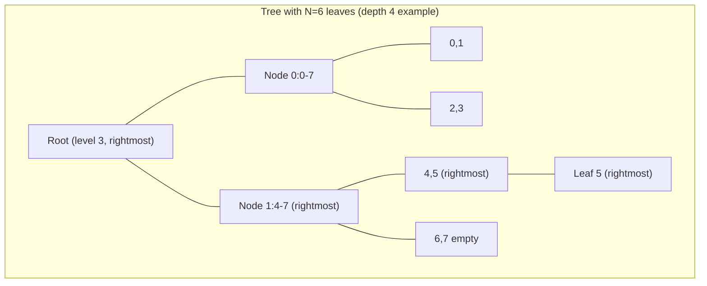
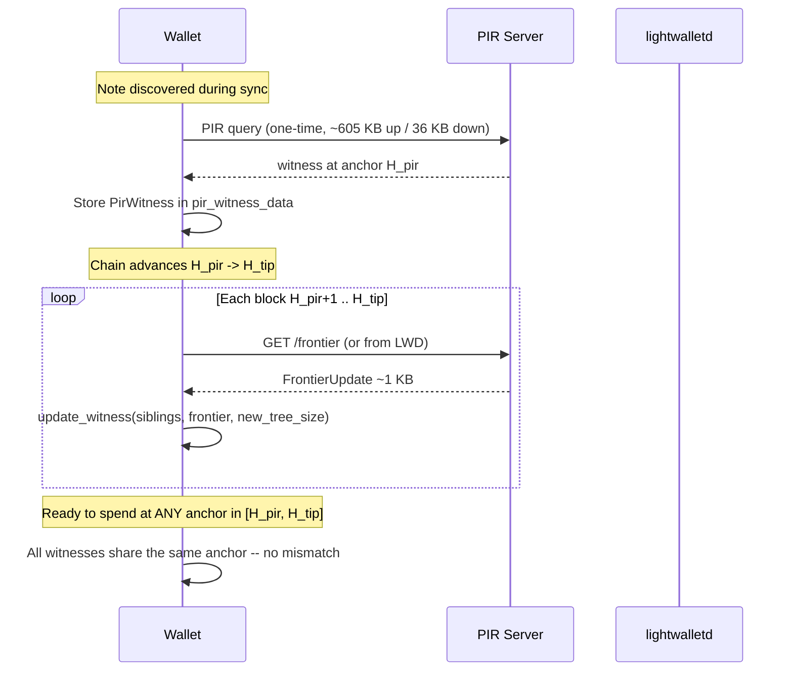

# Frontier-based witness updates for witness PIR

## The idea

In an append-only Merkle tree, when new leaves are appended only nodes on the **rightmost populated path** change. If the server broadcasts these 32 hashes (~1 KB) after each block, any client holding a PIR-obtained witness can update it locally to be valid against the new anchor -- no PIR re-query needed.

## Current pain points this solves

1. **Per-block YPIR rebuild**: The server currently runs `engine.setup()` (~2.7s) on the full 64 MB database every block, just to serve clients that already have witnesses but need them at a newer anchor.
2. **Anchor mismatch**: Witnesses fetched at different times get different `anchor_height` values. `pir_orchard_witnesses` requires a single anchor across all Orchard inputs, failing with `PIRWitnessAnchorMismatch` if they differ. The entire [PIR-aware anchor selection plan](spendability-pir/plans/pir-aware_anchor_selection_ad8167ac.plan.md) exists to work around this.
3. **Stale witnesses**: When the server's snapshot advances, previously-fetched witnesses prove against an old root and must be re-queried.

## What "rightmost path at each height" means

For a tree with N leaves (depth 32), the **rightmost path** is 32 node hashes -- one per level -- representing the nodes from the rightmost populated leaf to the root:

```
level h: node at position (N - 1) >> h
```




The rightmost path is: `[leaf_5_hash, node_hash(4,5), node_hash(4-7), root]`. These are the **only** nodes that change when leaf 6 is appended.

## The update algorithm

For a witness at position P with `siblings[0..31]`, when a block advances the tree from size N to N':

```
for each level h in 0..32:
    sibling_pos = (P >> h) ^ 1
    rightmost_pos = (new_tree_size - 1) >> h

    if sibling_pos == rightmost_pos:
        // Sibling IS the rightmost node -- its value changed
        siblings[h] = frontier_broadcast[h]
    elif sibling_pos > rightmost_pos:
        // Sibling is beyond the frontier -- still empty
        siblings[h] = empty_root(h)
    // else: sibling is to the left, fully populated, unchanged

new_root = compute_root_from_path(P, leaf_cmx, siblings)
```

This is ~32 comparisons + hash operations per update -- trivially fast.

## Multi-leaf blocks

A block typically adds ~3-5 notes. This means at lower levels, multiple nodes can change (not just the rightmost). The critical observation:

- **Levels 8-31** (sub-shard roots and above): With ~3-5 notes per block, all new notes almost always fall within the same subtree at level 8 (one sub-shard = 256 leaves). Only the rightmost node changes. The broadcast is sufficient.
- **Levels 0-7** (within sub-shard): Multiple leaf-level nodes can change, but there are two cases:
  - **Note in a completed sub-shard**: All 256 leaf slots are filled. Levels 0-7 are finalized and never change again. No update needed.
  - **Note in the frontier sub-shard**: The client needs the new `cmx` values. These are public in compact blocks (`CompactOrchardAction.cmx`), which the wallet downloads during sync anyway. The client inserts them into its locally-cached 256 leaves and recomputes levels 0-7.

For the astronomically rare case of a block with 256+ notes crossing a sub-shard boundary (never observed on mainnet), the client falls back to a fresh PIR query.

## Data flow with frontier updates




## Size analysis


| Data                           | Size                          | Frequency              |
| ------------------------------ | ----------------------------- | ---------------------- |
| Frontier update per block      | 32 x 32 + 8 = **1,032 bytes** | Every ~75s             |
| 1000 blocks of frontier data   | **~1 MB**                     | Catch-up               |
| Current: PIR re-query per note | **~641 KB**                   | Each time anchor moves |
| Current: broadcast refresh     | **~280 KB**                   | Each snapshot          |


A wallet 1000 blocks behind downloads ~1 MB of frontier data to bring ALL its witnesses to the tip. Compare with re-querying even a single note via PIR at 641 KB.

## Changes needed

### 1. `witness-types`: new `FrontierUpdate` type

Add to [witness-types/src/lib.rs](spendability-pir/witness/witness-types/src/lib.rs):

```rust
#[derive(Debug, Clone, Serialize, Deserialize)]
pub struct FrontierUpdate {
    pub height: u64,
    pub tree_size: u64,
    /// Hash of the rightmost populated node at each level, leaf-to-root.
    pub rightmost_nodes: [Hash; TREE_DEPTH],
}
```

### 2. `commitment-tree-db`: extract rightmost path

Add a method to `CommitmentTreeDb` in [commitment-tree-db/src/lib.rs](spendability-pir/witness/commitment-tree-db/src/lib.rs) that computes the 32 rightmost-path hashes from the current tree state. This walks from the rightmost leaf up through sub-shard, shard, and cap levels -- reusing the same Sinsemilla hashing already in `build_pir_db_and_broadcast`.

### 3. `witness-server`: frontier endpoint + storage

- **Store**: After each block in the follow loop ([server.rs ~461-488](spendability-pir/witness/witness-server/src/server.rs)), compute and store the `FrontierUpdate` in a ring buffer (keep last ~2000 blocks).
- **Endpoint**: `GET /frontier?from={height}&to={height}` returns a vec of `FrontierUpdate` for the requested range. Small, cacheable, public (no privacy concern -- it's the same data for everyone).
- **Optionally**: Stream via SSE for connected clients.

### 4. `witness-client`: `update_witness` function

Add to [witness-client/src/reconstruct.rs](spendability-pir/witness/witness-client/src/reconstruct.rs):

```rust
pub fn update_witness(
    witness: &mut PirWitness,
    frontier: &FrontierUpdate,
    // The 256 leaves of the note's sub-shard (from initial PIR query, 
    // updated with new cmx values if the note is in the frontier sub-shard)
    subshard_leaves: Option<&[Hash; SUBSHARD_LEAVES]>,
) -> Hash {
    let position = witness.position;
    let tree_size = frontier.tree_size;

    for h in 0..TREE_DEPTH {
        let sibling_pos = (position >> h) ^ 1;
        let rightmost_pos = (tree_size - 1) >> h;

        if sibling_pos == rightmost_pos as u64 {
            witness.siblings[h] = frontier.rightmost_nodes[h];
        } else if sibling_pos > rightmost_pos as u64 {
            witness.siblings[h] = empty_root(h as u8);
        }
        // else: finalized, keep existing
    }

    // If subshard_leaves provided (frontier sub-shard), recompute levels 0-7
    if let Some(leaves) = subshard_leaves {
        let leaf_idx = witness.leaf_index() as usize;
        extract_siblings(leaves, leaf_idx, 0, &mut witness.siblings);
    }

    let leaf = if let Some(leaves) = subshard_leaves {
        leaves[witness.leaf_index() as usize]
    } else {
        // Must be passed or stored; the note's cmx doesn't change
        // Recompute root using existing data
        todo!("need note cmx")
    };

    let root = compute_root_from_path(position, &leaf, &witness.siblings);
    witness.anchor_height = frontier.height;
    witness.anchor_root = root;
    root
}
```

### 5. Server: decouple PIR rebuild from frontier broadcast

The biggest operational win: the server no longer needs to run YPIR `engine.setup()` every block for the benefit of existing witness holders. PIR DB rebuild can happen less frequently (e.g., every 10 blocks, or only when a new PIR query actually arrives). The frontier broadcast handles freshness for clients with existing witnesses. This saves ~2.7s of CPU per block.

### 6. Wallet integration changes

- `**pir_witness_data` table**: Add `subshard_leaves BLOB` column (8 KB) to cache the initial PIR-returned leaves for frontier sub-shard notes. Completed sub-shard notes don't need this.
- **Frontier cache**: New table or in-memory cache for recent `FrontierUpdate` entries.
- `**update_pir_witnesses`**: New Rust FFI function that applies a batch of frontier updates to all stored PIR witnesses, bringing them to a target anchor height.
- **Anchor alignment becomes trivial**: Instead of re-querying PIR, just apply frontier updates. The [PIR-aware anchor selection plan](spendability-pir/plans/pir-aware_anchor_selection_ad8167ac.plan.md) simplifies dramatically -- no need for `alignProposalWitnesses` or `getPIRAnchorStatus`.

### 7. Reorg handling

When a reorg occurs:

- Server: discard frontier updates above the rollback height (same as current `rollback_to` behavior).
- Client: discard any frontier updates applied above the rollback height, revert witnesses to the last pre-rollback anchor. Since the witness update is deterministic, the client can re-apply from the divergence point once the new chain is available.

## What this does NOT change

- **Initial PIR query**: Still needed to get the first witness (the 256 sub-shard leaves and the initial 32 siblings). The frontier update mechanism is for keeping it fresh.
- **Broadcast data**: The existing `BroadcastData` (cap + sub-shard roots) is still needed for the initial reconstruction. Frontier updates supplement it for subsequent blocks.
- **Privacy model**: Frontier data is public (same for all clients), same as the current broadcast. No privacy regression.
- **Fallback**: If the client misses frontier updates for too long and the server's ring buffer has evicted them, the client re-queries PIR -- graceful degradation.

## Open question: where does the frontier come from?

Two options for how the client gets frontier updates:

1. **From the PIR server** (new endpoint): Clean separation, the server already has the tree. Adds a lightweight endpoint.
2. **From lightwalletd** (`GetTreeState`): lightwalletd already serves the Orchard frontier per block. The wallet could derive rightmost-path hashes from it. However, `GetTreeState` returns an incrementalmerkletree `Frontier` (ommers format), not the rightmost-path format we need. The conversion is possible but adds complexity.
3. **Compute client-side from compact blocks**: The client receives `cmx` values in compact blocks during sync. If it maintained a local incremental frontier, it could compute the rightmost path itself. But this requires the client to process every block's commitments in order -- which it's already doing during sync.

Option 1 is simplest. Option 3 is most self-sufficient but duplicates work the wallet already does (and the wallet may not be caught up, which is the whole reason PIR exists).

## Summary

The core modification is adding a **~1 KB per-block frontier broadcast** and a **client-side witness update function**. This eliminates the tight coupling between PIR query time and anchor validity, turns anchor alignment into a local operation, and lets the server skip expensive YPIR rebuilds for blocks where no new queries arrive.