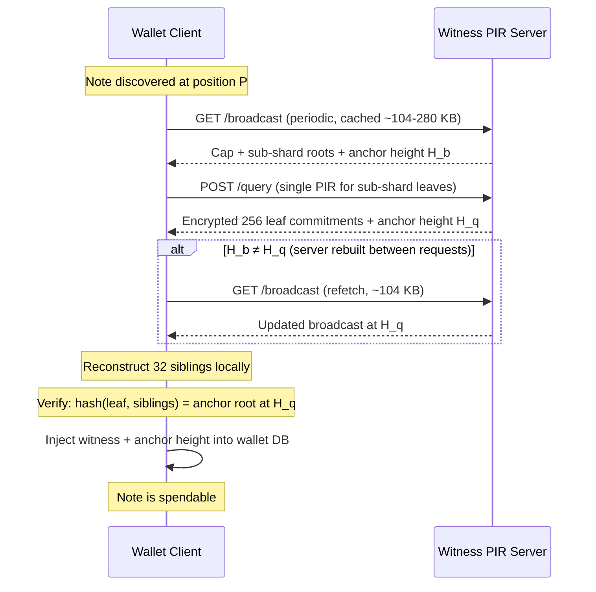

# PIR-Assisted Note Commitment Witness Construction

## Goal

Enable notes to be **spendable immediately upon discovery during sync**, before the wallet has finished scanning. Once the wallet is fully synced, it has sufficient local data (ShardTree) to construct witnesses on its own — PIR is not needed for a caught-up wallet. The PIR witness system bridges the gap between note discovery and sync completion.

## Problem

When a note is discovered during sync, two blockers prevent spending:

1. **Shard tree completeness**: The shard (2^16 = 65,536 leaves, height 16) containing the note must be fully scanned. `witness_at_checkpoint_id_caching()` in `[zcash_client_backend/src/data_api/wallet.rs](zcash_client_sqlite/zcash_client_backend/src/data_api/wallet.rs)` cannot produce a Merkle path until the shard is complete.
2. **Unscanned tip gate**: `unscanned_tip_exists()` in `[zcash_client_sqlite/src/wallet/common.rs](zcash_client_sqlite/zcash_client_sqlite/src/wallet/common.rs)` blanket-rejects all notes from `select_spendable_notes` if any unscanned ranges exist up to the anchor height.

These create a window (30s–1min or longer, depending on how far behind the wallet is) where a discovered note cannot be spent. The PIR witness system eliminates this window by providing the authentication path from an external server, bypassing the need for local shard completion.

### Witness lifecycle

1. **During sync** (PIR active): Note discovered at position P. The wallet's ShardTree is incomplete — it cannot produce a witness. The wallet queries the PIR server, which returns a complete authentication path at anchor height H. The wallet stores this witness and marks the note spendable.
2. **Wallet catches up**: Sync completes. The ShardTree now has the full shard and can produce witnesses locally. The PIR-obtained witness remains valid and usable — there is no need to re-derive it.
3. **Steady state** (PIR unnecessary): The wallet is synced. New notes arrive near the tip. The ShardTree can produce witnesses directly from locally-scanned data. PIR is not queried.

PIR is a **sync-time accelerator**, not a permanent replacement for the ShardTree. The server needs to maintain tree data for the historical range that wallets are likely to be syncing through, not necessarily the absolute tip.

## Key data: shard geometry and 6-month volume

Orchard uses depth 32 with `SHARD_HEIGHT = 16`, so each shard covers 2^16 = 65,536 leaves. Sapling is out of scope — its volume is declining (~13K notes/month vs Orchard's ~100K/month) and the pool is expected to sunset.

At the current mainnet rate of ~3,465 Orchard notes/day:

- One shard fills in **~19 days**
- 6-month window: **~623,694 notes = ~9.5 shards**
- Total leaf data for 6 months: 623,694 x 32 = **~19.5 MB**
- Total populated shards on mainnet: **~761 completed + 1 frontier**

The small 6-month volume makes a three-tier design unnecessary. The amended design collapses Tier 0 + Tier 1 into a single broadcast and uses a single PIR tier. With a 5-second rebuild budget, L0 is sized at 8,192 rows (32 shards, ~2.1M notes, 64 MB), covering ~1.7 years of Orchard history at current rates.

## Design: Broadcast + Single-Tier PIR Witness Service

A server maintains the full Orchard note commitment tree (depth 32). The tree is decomposed at two depths, but only the lowest tier uses PIR:

```
Depth 0 (root)
  |
  | Broadcast — cap (shard roots array)
  | 16 levels, ~762 populated shard roots on mainnet
  | ~24 KB (762 x 32 bytes); client rebuilds cap tree locally
  |
Depth 16 (shard roots)
  |
  | Broadcast — sub-shard roots for active window
  | 8 levels within each shard, 256 sub-shard roots per shard
  | Up to 32 shards x 256 x 32 = ~256 KB at capacity
  |
Depth 24 (sub-shard roots)
  |
  | PIR — leaf commitments per sub-shard
  | 8 levels, 256 leaves per sub-shard
  | 8,192 rows (padded) x 8 KB = ~64 MB database
  |
Depth 32 (note commitments)
```

### Why not three tiers?

With only ~10 shards in 6 months at current volume, Tier 1 PIR would have ~10 rows. PIR on 10 rows is wasteful — the query/response overhead dwarfs the data. Broadcasting the sub-shard roots costs at most ~256 KB (at full 32-shard capacity) and provides the same information with zero PIR machinery. This also eliminates one round trip.

### Tier parameters

- **Broadcast (cap + sub-shard roots)**: Downloaded periodically by the client (cached, refreshed when stale or on verification failure).
  - Cap: the server broadcasts **all populated shard roots** as an array (~762 × 32 = ~24 KB). The client rebuilds the depth-16 cap tree locally: positions 0..761 get the shard roots, positions 762..65535 are `MerkleHashOrchard::empty_root(Level::from(16))`. Since the tree is left-packed and the empty-root values are precomputed constants, only the ~762 populated leaves need hashing — ~12K Sinsemilla operations, well under 50ms on mobile. The server includes the frontier shard's current (incomplete) root alongside the completed shard roots from lightwalletd's `GetSubtreeRoots`.
  - Sub-shard roots for active window: scales with populated shards — ~80 KB at 10 shards (6-month window), up to ~256 KB at full 32-shard capacity.
  - **Total broadcast: ~104 KB initially (24 KB cap + 80 KB sub-shard roots), up to ~280 KB at capacity.** Provides **24 of 32** authentication path siblings.
- **PIR tier (sub-shard leaf data)**: One row per populated sub-shard, padded to 8,192 rows.
  - Row size: 256 leaves x 32 bytes = 8,192 bytes
  - **Database: 64 MB** (padded to full capacity regardless of fill level; 8,192 rows × 8 KB)
  - **Bandwidth: ~605 KB per query** (single PIR round trip, `nu_1 = 0`)
  - Provides the final **8 of 32** authentication path siblings.
  - Capacity: 32 shards = ~2.1M notes = ~1.7 years at current rates.
  - **Row layout**: Rows are dense within the window. The PIR database covers a contiguous shard range `[window_start_shard, window_start_shard + window_shard_count)`. Physical PIR row index = `(shard_index - window_start_shard) * 256 + subshard_index`. Rows beyond the populated range (up to the padded 8,192) are zero-filled. The broadcast includes `window_start_shard` and `window_shard_count` so the client can compute the physical row index.

### Client witness reconstruction

Given a note at tree position P (32-bit):

```
shard_index    = P >> 16          (which shard — top 16 bits)
subshard_index = (P >> 8) & 0xFF  (which sub-shard within shard — middle 8 bits)
leaf_index     = P & 0xFF         (which leaf within sub-shard — bottom 8 bits)
```

1. **Broadcast data** (cached): Extract 16 cap siblings using `shard_index`, then 8 upper intra-shard siblings using `subshard_index` from the broadcast sub-shard roots. Verify: hash of 256 sub-shard roots matches the shard root from cap.
2. **PIR query** for physical row `(shard_index - window_start_shard) * 256 + subshard_index`: Receive 256 leaf commitments. Build local 8-level tree, extract 8 lower siblings using `leaf_index`. Verify: hash of 256 leaves matches sub-shard root from broadcast. (The broadcast includes `window_start_shard` so the client can compute the physical row index.)
3. **Assemble**: 16 + 8 + 8 = 32 sibling hashes = complete Merkle authentication path.
4. **Self-verify**: Hash the note commitment through all 32 siblings. Result must equal the anchor root (publicly known from the chain). This catches server errors or malicious data.




### Broadcast-to-PIR consistency

Both the broadcast and the PIR response include the anchor height. The client compares them before attempting verification. A mismatch means the server rebuilt between the two requests — the client refetches the broadcast (small and cheap) and retries. For completed shards this never happens: their data is immutable regardless of anchor height. Only the frontier shard's active sub-shard can trigger a mismatch, and the refetch resolves it in one round trip. The self-verification (hash leaf-to-root against the publicly-known anchor root) is the ultimate safety net — even if the heights match, a corrupted or malicious response is detected.

### Database update strategy

Follows the same per-block rebuild cycle as the nullifier PIR server (`spend-server`'s follow loop): ingest each new block, update the tree, rebuild PIR, atomic swap via `ArcSwap`. The ingest and rebuild infrastructure from `sync-nullifier-pir` (chain tracking, reorg handling, snapshot/restore, follow loop, `ArcSwap` state management) is reused directly — `commitment-ingest` replaces `nf-ingest`'s parser but shares `ChainTracker`, `LwdClient`, and the sync/follow lifecycle.

- **Completed shards**: Sub-shard root data (broadcast) and leaf rows (PIR) are **immutable** once the shard is full (~every 19 days). Compute once, serve forever.
- **Frontier shard**: Updated every block. Only the active sub-shard row changes; other sub-shards within the frontier may already be complete. At ~3 notes/block, the frontier sub-shard row changes by ~96 bytes per block.
- **Broadcast data**: Regenerated alongside every PIR rebuild. Cap updates when a new shard completes (~every 19 days) or when the frontier hash changes (every block). Negligible cost.
- **Eviction**: Old sub-shard rows are evicted from the PIR database when L0 exceeds 32 shards, similar to `HashTableDb::evict_to_target()`. At current volume this takes ~1.7 years.
- **PIR rebuild**: At 64 MB (padded), full YPIR setup takes ~3.5 seconds — well under the 75-second block interval. The database is padded to 8,192 rows from the start; rebuild time is constant regardless of fill level.

### Anchor depth and confirmation policy

The witness server uses `CONFIRMATION_DEPTH = 10`, the same value as the nullifier PIR server. This constant moves to `shared/pir-types` so both servers share it.

**Why 10**: The wallet's `ConfirmationsPolicy` has three settings — transfer trusted (3), transfer untrusted (10), shielding (1). The wallet picks a **single anchor per transaction** using the trusted value (`tip - 3`) and then filters individual notes by their confirmation depth. The PIR server doesn't need to match this exactly — it serves witnesses at one anchor height, and the wallet uses whatever anchor the server provides. An anchor at `tip - 10` satisfies all policies since it's deeper than all of them. Using 10 also provides reorg safety: a 4-block reorg won't invalidate the served tree state.

**No multiple databases needed**: One PIR database at one anchor height serves all confirmation policies. The confirmation policy controls which notes are eligible for spending, not the anchor height of the tree state. The wallet selects `anchor = tip - trusted_confirmations` (tip - 3) for its own ShardTree, but for PIR-obtained witnesses the wallet simply uses the anchor provided by the server.

**Freshness is irrelevant**: The difference between `tip - 3` and `tip - 10` is ~9 minutes. The PIR witness system targets wallets that are seconds to minutes behind during sync — the 7-block difference is negligible. By the time the wallet reaches `tip - 10` in its own scan, it can construct witnesses locally and doesn't need PIR at all.

### Scaling: LSM-style tiered PIR

At current volume, L0 (~64 MB, ~3.5s rebuild) covers ~1.7 years of Orchard history. Tiering is unnecessary today. If Orchard adoption increases, L0 fills faster and per-block rebuilds of a larger database become expensive. Completed shards' data is immutable, so rebuilding them every block is wasted work.

The solution borrows from LSM-trees: L0 absorbs new data with per-block rebuilds, and flushes completed shards into a cold tier that rebuilds infrequently.

#### Tier structure

```
L0 (hot)     The v1 design — broadcast + single PIR database.
             Contains frontier shard + recent completed shards.
             Rebuilds every block. Bounded at 8,192 rows for ~3.5s rebuild.
             When full (32 shards), flush completed shards into L1.

L1 (cold)    Accumulated completed shards from L0 flushes.
             Rebuilt only on flush (every few weeks to months).
```

At current volume, only L0 exists. L1 activates when volume increases enough to fill L0's 32 shards faster than is useful (roughly 5x current volume).

#### Tier capacity and YPIR parameters

All tiers use the same row format (8,192 bytes per sub-shard row, YPIR SimplePIR `instances = 3`).


|                    | L0 (hot)    | L1 (cold) |
| ------------------ | ----------- | --------- |
| YPIR `nu_1`        | 0           | 6         |
| `db_rows` (padded) | 8,192       | 131,072   |
| Shards capacity    | 32          | 512       |
| Notes capacity     | 2.1M        | 33.6M     |
| DB size            | 64 MB       | 1 GB      |
| Rebuild time       | ~3.5s       | ~55s      |
| Rebuild trigger    | Every block | L0 flush  |


Total capacity across both tiers: 544 shards, ~35.7M notes.

#### Per-tier query sizes


|                    | L0     | L1       |
| ------------------ | ------ | -------- |
| Query upload       | 605 KB | 1,553 KB |
| Response download  | 36 KB  | 36 KB    |
| Server online time | ~96 ms | 1.6 s    |


The fixed `pub_params` component (541 KB) dominates the L0 query. The `packed_query_row` part (`db_rows x 8` bytes) only becomes significant at L1.

#### Combined per-witness bandwidth

The client queries **all live tiers** for privacy, plus downloads the broadcast:


| Active tiers      | Upload | Download          | Server time |
| ----------------- | ------ | ----------------- | ----------- |
| L0 only (current) | 605 KB | 36 KB + broadcast | ~96 ms      |
| L0 + L1           | 2.2 MB | 72 KB + broadcast | ~1.7 s      |


For comparison, the nullifier PIR ZIP targets ~3.3 MB per query. Even the full two-tier fan-out stays within that budget.

#### Volume thresholds


| Volume       | Notes/day | Shard fill rate | L0 fills in | Active tiers |
| ------------ | --------- | --------------- | ----------- | ------------ |
| 1x (current) | ~3,500    | ~19 days        | ~1.7 years  | L0 only      |
| 5x           | ~17,500   | ~4 days         | ~4 months   | L0 + L1      |
| 10x          | ~35,000   | ~2 days         | ~2 months   | L0 + L1      |
| 50x          | ~175,000  | ~9 hours        | ~12 days    | L0 + L1      |
| 100x         | ~350,000  | ~4.5 hours      | ~6 days     | L0 + L1      |


#### Flush mechanics

Flush follows the LSM pattern. The old L0 remains live until L1 is rebuilt and atomically swapped in (via `ArcSwap`, same as the nullifier PIR server).

1. L0 accumulates completed shards until it approaches 32.
2. **Flush**: completed shard rows are copied into L1's input buffer. L1 rebuilds in the background (~55s).
3. L1 rebuild completes; atomically swap the new L1 state. L0 drops the flushed rows and rebuilds (~3.5s).
4. During the rebuild window, the flushed rows temporarily exist in both L0 and L1. This is harmless — the client gets the same answer from either tier. At steady state, each sub-shard row lives in exactly one tier.

#### V1 design implications

The v1 implementation builds L0 only. At current volume, L0's 32-shard capacity covers ~1.7 years of Orchard history, so tiering is deferred until volume grows ~5x. To enable future tiering without architectural changes, the `commitment-tree-db` API should track completed vs. frontier shard membership so that `build_pir_db()` can later become per-tier builders. The `PirEngine` trait is already abstract enough to support multiple instances. The wallet-facing interface (`get_witness(position) -> Result<PirWitness, WitnessError>`) is identical regardless of how many tiers exist behind it.

### Workspace layout and reorganization

Phase 0 (prerequisite): Restructure the current flat `sync-nullifier-pir/` workspace into a parent workspace with two sub-workspaces. The nullifier and witness systems are separate packages that share common dependencies.

```
sync-nullifier-pir/
├── Cargo.toml                # parent workspace, defines [workspace] members + shared deps
├── proto/                    # shared: compact_formats.proto, service.proto
├── shared/
│   ├── pir-types/            # PirEngine trait, YpirScenario, ServerPhase (extracted from spend-types)
│   └── chain-ingest/         # LwdClient, ChainTracker, sync/follow streams (extracted from nf-ingest)
├── nullifier/
│   ├── spend-types/          # nullifier-specific constants (NUM_BUCKETS, BUCKET_BYTES, hash_to_bucket, etc.)
│   ├── hashtable-pir/
│   ├── nf-ingest/            # nullifier extraction (parser module), depends on chain-ingest
│   ├── spend-server/
│   └── spend-client/
├── witness/
│   ├── witness-types/
│   ├── commitment-ingest/    # note commitment extraction, depends on chain-ingest
│   ├── commitment-tree-db/
│   ├── witness-server/
│   └── witness-client/
├── combined-server/          # optional: single binary running both servers in-process
└── note-witness/             # analysis / design docs (existing README.md)
```

**Shared crate extraction**:

- `shared/pir-types` — extracted from `spend-types`: `PirEngine` trait, `YpirScenario`, `ServerPhase`, `NU5_MAINNET_ACTIVATION`, `CONFIRMATION_DEPTH`. What stays in `nullifier/spend-types`: `NUM_BUCKETS`, `BUCKET_CAPACITY`, `ENTRY_BYTES`, `BUCKET_BYTES`, `DB_BYTES`, `hash_to_bucket`, `ChainEvent`, `NewBlock`, `OrphanedBlock`, `SpendabilityMetadata` (all nullifier-specific).
- `shared/chain-ingest` — extracted from `nf-ingest`: `LwdClient` (`client.rs`), `ChainTracker`/`ChainAction` (`chain_tracker.rs`), proto types (`proto.rs` + generated code). What stays in `nullifier/nf-ingest`: `parser.rs` (`extract_nullifiers`), `ingest.rs` (nullifier-specific sync/follow that calls `extract_nullifiers` and emits `ChainEvent`). The witness-side `commitment-ingest` writes its own sync/follow loop using the same `LwdClient` + `ChainTracker` from `chain-ingest`, but extracts `CompactOrchardAction.cmx` instead of nullifiers.

The parent `Cargo.toml` uses `[workspace.dependencies]` to pin shared git deps (`ypir`, `spiral-rs`, `tonic`, `prost`) once:

```toml
[workspace]
resolver = "2"
members = [
    "shared/pir-types", "shared/chain-ingest",
    "nullifier/spend-types", "nullifier/hashtable-pir", "nullifier/nf-ingest",
    "nullifier/spend-server", "nullifier/spend-client",
    "witness/witness-types", "witness/commitment-ingest", "witness/commitment-tree-db",
    "witness/witness-server", "witness/witness-client",
    "combined-server",
]

[workspace.dependencies]
ypir = { git = "https://github.com/valargroup/ypir.git", branch = "valar/artifact", default-features = false }
spiral-rs = { git = "https://github.com/valargroup/spiral-rs.git", branch = "valar/avoid-avx512" }
tonic = "0.12"
prost = "0.13"
tokio = { version = "1", features = ["full"] }
axum = "0.7"
arc-swap = "1"
```

**Deployment modes**:

1. **Separate binaries** (default): `nullifier/spend-server` and `witness/witness-server` each have a `[[bin]]` target and run as independent processes. Each connects to lightwalletd independently (or shares a connection via config). This is the simplest deployment — two systemd services, each with its own port.
2. **Combined in-process**: `combined-server/` depends on both `spend-server` and `witness-server` as libraries and runs both on a single Axum router (different route prefixes: `/nullifier/...` and `/witness/...`). Single process, single lightwalletd connection, single port. The `chain-ingest` streams feed both the hash table and the commitment tree from the same compact block flow, halving lightwalletd load.

Both modes produce identical client-facing APIs — the client libraries (`spend-client`, `witness-client`) don't care whether they're hitting one server or two.

**Migration path**: Phase 0 reorganizes the existing crates into `nullifier/` without changing any code — just moves directories and updates `Cargo.toml` paths. All existing tests pass. Then witness crates are built in `witness/` incrementally. The combined server is added last, after both systems work independently.

### Server components (new crates in `witness/`)

Reuse the YPIR engine, HTTP framework, and ingest patterns via the shared crates.

- `**witness-types`**: Constants (`TREE_DEPTH=32`, `SHARD_HEIGHT=16`, `SUBSHARD_HEIGHT=8`, `SUBSHARD_LEAVES=256`), shared types, anchor tracking. Key types:
  - `PirWitness { position: Position, siblings: [MerkleHashOrchard; 32], anchor_height: BlockHeight, anchor_root: MerkleHashOrchard }` — complete witness bundle returned by `get_witness()`. Contains everything needed to convert to `MerklePath<MerkleHashOrchard>` and to verify/store in the wallet. `position` determines the left/right merge direction at each level; `anchor_root` is included for self-verification.
  - `CapData` — serialized shard roots for cap tree reconstruction.
  - `BroadcastData` — cap + sub-shard roots + `window_start_shard` + `window_shard_count` + `anchor_height`.
- **commitment-ingest**: Depends on `chain-ingest` for `LwdClient`, `ChainTracker`, and sync/follow streams. Adds a parser that extracts Orchard note commitments (`CompactOrchardAction.cmx`) instead of nullifiers. Feeds them into the tree builder.
- **commitment-tree-db**: Maintains the incremental Merkle tree in memory. Internal nodes are computed using `MerkleHashOrchard::combine(level, left, right)` (Sinsemilla hash) and empty subtrees use `MerkleHashOrchard::empty_root(level)` — these are level-dependent, not a single constant. This requires the `orchard` crate as a dependency. Key operations:
  - `append_commitments(height, commitments)` — extend the tree
  - `rollback_to(height)` — handle reorgs
  - `shard_roots() -> Vec<(shard_idx, Hash)>` — for cap construction
  - `subshard_roots(shard_idx) -> [Hash; 256]` — broadcast data
  - `subshard_leaves(shard_idx, subshard_idx) -> [Hash; 256]` — PIR row data. Leaf positions beyond the tree's current frontier are filled with `MerkleHashOrchard::empty_root(Level::from(0))`, **not** zero bytes. This ensures the client computes the correct sub-shard root for partially-filled sub-shards (the frontier).
  - `build_pir_db() -> Vec<u8>` — row-major bytes for single YPIR setup. Rows within the populated window use `subshard_leaves()` (which includes proper empty-leaf sentinels). Padding rows beyond the window are zero-filled — the client never queries these, they exist only to pad the database to a power of two.
  - Snapshot/restore (same pattern as `[hashtable-pir/src/snapshot.rs](sync-nullifier-pir/hashtable-pir/src/snapshot.rs)`)
- `**witness-server`**: Axum HTTP server (same pattern as `[spend-server](sync-nullifier-pir/spend-server/src/server.rs)`):
  - `GET /health` — liveness
  - `GET /metadata` — anchor height, tree size, epoch, `window_start_shard`, `window_shard_count`
  - `GET /broadcast` — shard roots array + sub-shard roots for active window (~104–280 KB). Includes `window_start_shard` and `window_shard_count` so the client can map note positions to physical PIR row indices. Client rebuilds the depth-16 cap tree locally from the shard roots.
  - `GET /params` — YPIR parameters for the single PIR tier
  - `POST /query` — YPIR query against the sub-shard leaf database
  - Single `PirEngine` instance
  - Exposes `build_router()` as a library function (like `spend-server` does) so the combined server can mount it
- **witness-client**: Client library mirroring `[spend-client](sync-nullifier-pir/spend-client/src/lib.rs)`:
  - `WitnessClient::connect(url)` — fetch params, initialize single `YPIRClient`
  - `get_broadcast()` — download and cache cap + sub-shard roots
  - `get_witness(position) -> Result<PirWitness, WitnessError>` — checks position is within the server's window (using `window_start_shard` and `window_shard_count` from cached broadcast), issues one PIR query, reconstructs the authentication path locally, self-verifies against the anchor root. Returns `WitnessError::NoteOutsideWindow` if the note's shard falls outside `[window_start_shard, window_start_shard + window_shard_count)` — the wallet should fall back to waiting for local scan.
  - `WitnessClientBlocking` — sync wrapper for FFI (same pattern as `SpendClientBlocking`)

### Wallet integration (future scope)

Wallet-side changes (`zcash_client_sqlite`, `zcash-swift-wallet-sdk`, `zodl-ios`) are out of scope for the initial PIR witness server implementation. The server + client crates must be validated end-to-end against mainnet data before modifying the wallet. The following integration points define the compatibility contract that the PIR system must satisfy.

#### Integration point 1: PirWitness → MerklePath conversion

The PIR client produces a `PirWitness { position, siblings, anchor_height, anchor_root }`. The 32 sibling hashes are ordered leaf-to-root, and `position` encodes the left/right direction at each level. This must be convertible to `incrementalmerkletree::MerklePath<orchard::tree::MerkleHashOrchard>`, which is `{ position: Position, path: Vec<MerkleHashOrchard> }` — the same format returned by `ShardTree::witness_at_checkpoint_id_caching()` (`[wallet.rs:1058](zcash_client_sqlite/zcash_client_backend/src/data_api/wallet.rs)`). The hash function is Sinsemilla (via `MerkleHashOrchard::combine`).

Constraint: `PirWitness.siblings` must match the `MerklePath.path` byte layout. The conversion is `MerklePath { position: witness.position, path: witness.siblings.to_vec() }`. The `anchor_height` and `anchor_root` are metadata for wallet storage and verification, not part of the `MerklePath` itself.

#### Integration point 2: Anchor root verification

The PIR witness is bound to a specific anchor height H. The client self-verifies by hashing leaf-to-root and comparing against the anchor root. This root must agree with what `root_at_checkpoint_id(&H)` returns from the wallet's ShardTree. Source of truth for validation: lightwalletd's `GetTreeState(BlockID { height: H })` returns `TreeState.orchardTree`, from which the tree root can be derived.

Constraint: the `commitment-tree-db` must use the same empty-subtree sentinel values and hash function as the protocol (`MerkleHashOrchard::empty_root(Level)`), so the computed root matches the chain-committed root exactly.

#### Integration point 3: Note position

The wallet stores `commitment_tree_position` (type `incrementalmerkletree::Position`) in `orchard_received_notes`. The PIR query input is this same position value. The decomposition `shard_index = P >> 16`, `subshard_index = (P >> 8) & 0xFF`, `leaf_index = P & 0xFF` must agree with how `ShardTree` addresses leaves (which it does — `Position` is a u64 leaf index in the append-only tree, and `SHARD_HEIGHT = 16` means shard index = `P >> 16`).

Constraint: the logical sub-shard address is `(shard_index, subshard_index)`, derived from the note position. The physical PIR row index is `(shard_index - window_start_shard) * 256 + subshard_index`, where `window_start_shard` comes from the broadcast metadata. The wallet (or client library) must use the broadcast's window range to compute the correct physical row index for the PIR query.

#### Integration point 4: Gate bypass pattern

When the wallet is later modified to use PIR witnesses, it needs to bypass two gates:

1. `unscanned_tip_exists()` — same `skip_unscanned_check` pattern already used for `sync-nullifier-pir` Orchard notes (`[common.rs:554-557](zcash_client_sqlite/zcash_client_sqlite/src/wallet/common.rs)`).
2. `scan_state.max_priority <= Scanned` — the SQL filter in `select_spendable_notes_matching_value` that requires the note's shard to be fully scanned.

The PIR system does not need to implement these bypasses, but the `PirWitness` it produces carries all necessary information (position, siblings, anchor height, anchor root) for the wallet to store in a side table (cf. `pir_spent_notes`) and use during note selection and transaction building.

#### Integration point 5: Transaction builder witness injection

The transaction builder (`[wallet.rs:1057-1067](zcash_client_sqlite/zcash_client_backend/src/data_api/wallet.rs)`) calls `witness_at_checkpoint_id_caching(position, &anchor_height)` on the ShardTree. A future integration would check a `pir_witness_data` table first, falling back to ShardTree. The stored `PirWitness` provides `position`, `siblings`, `anchor_height`, and `anchor_root` — enough to construct `MerklePath<MerkleHashOrchard>` and the anchor for the transaction builder.

#### Summary of future wallet work

- `zcash_client_sqlite`: new `pir_witness_data` table, `sync-witness-pir` feature flag, gate bypass, transaction builder fallback
- `zcash-swift-wallet-sdk`: Rust FFI (`zcashlc_get_pir_witness`), Swift wrapper, `ScanAction` trigger on note discovery
- `zodl-ios`: wire into `CompactBlockProcessor`, UI for PIR-accelerated spendability

These follow the same patterns established by nullifier PIR (`pir_spent_notes`, `SpendabilityBackend`, `PIRDebugStore`).

### End-to-end validation milestone

Before any wallet integration, the PIR witness system must pass an end-to-end test against real mainnet data. This is the gate for declaring the server + client ready.

**Test A: tree correctness (fast, stub PIR)**

Validates tree construction, sub-shard decomposition, and witness reconstruction without YPIR overhead. Uses `pir_stub` (direct row retrieval by index) instead of encrypted queries.

1. **Ingest**: `commitment-ingest` syncs the Orchard note commitment tree from lightwalletd (`zec.rocks:443`) up to a target height H.
2. **Pick a real note**: Choose a known Orchard note commitment at a known tree position P. Extract from a specific compact block's `CompactOrchardAction.cmx`, compute P from the previous block's `orchardCommitmentTreeSize` plus the action's index within the block.
3. **Build database**: `commitment-tree-db` builds the tree, produces broadcast data and raw PIR row bytes.
4. **Stub retrieval**: Look up the sub-shard row directly by physical index (no YPIR encode/decode). Reconstruct the full 32-sibling authentication path from broadcast + raw row data.
5. **Verify against lightwalletd**: Call `GetTreeState(BlockID { height: H })` to get the `orchardTree` frontier (hex-encoded `CommitmentTree`). Deserialize via `read_commitment_tree`, call `.root()` to get the Orchard tree root. Confirm that hashing the note commitment through the 32 siblings produces this exact root. (Requires `incrementalmerkletree` and `orchard` as dev-dependencies for deserialization.)
6. **Cross-validate against ShardTree**: Insert the same note commitments into a local `ShardTree` (using the `shardtree` crate), call `witness_at_checkpoint_id`, and confirm the authentication path matches the PIR-obtained path byte-for-byte.

**Test B: full PIR round-trip (slow, YPIR)**

Same as Test A but steps 3-4 go through the real YPIR pipeline: `witness-server` builds the YPIR database (~3.5s setup), `witness-client` generates an encrypted query, server answers, client decodes. Validates that the PIR layer preserves correctness end-to-end.

**What these prove**:

- The tree construction (Sinsemilla hash, level-dependent empty-subtree sentinels, append ordering) is correct
- The sub-shard decomposition and dense-within-window PIR row indexing match the canonical tree layout
- The witness reconstruction (broadcast + PIR → 32 siblings) produces protocol-valid authentication paths
- The anchor root agrees with the chain-committed state (verified against `GetTreeState`)
- The `PirWitness` format is compatible with what `ShardTree` would produce (integration point 1)
- (Test B only) The YPIR encode/decode cycle preserves the correct row data

**Implementation**: Rust integration tests in the workspace (e.g. `witness-client/tests/`). Both require network access to lightwalletd and are tagged `#[ignore]` for CI, runnable on demand. Test A runs in seconds (ingest time dominates). Test B adds ~5-10 seconds for YPIR setup + query. The `shardtree`, `incrementalmerkletree`, and `orchard` crates are dev-dependencies for the cross-validation step.

### Security properties

- **Privacy**: YPIR guarantees the server learns nothing about which position was queried. The client's note could be at any of the ~50M positions.
- **Correctness**: The client self-verifies every witness by hashing from leaf to root and comparing against the publicly-known anchor root. A malicious server cannot provide an invalid witness that passes this check.
- **Availability**: If the PIR server is down, the wallet falls back to normal shard scanning — spendability is delayed until sync completes, but never blocked. PIR is a performance optimization, not a correctness dependency.

### Data sizes summary (~3,465 notes/day)

- **Broadcast (shard roots + sub-shard roots)**: ~104 KB initially (24 KB cap + 80 KB sub-shard roots for 10 shards), up to ~280 KB at full L0 capacity (32 shards). Downloaded periodically. Client rebuilds cap tree locally.
- **PIR database**: 8,192 rows x 8 KB = 64 MB (fixed, padded to capacity regardless of fill level)
- **PIR bandwidth per witness**: ~605 KB upload + 36 KB download (single round trip, `nu_1 = 0`)
- **Total per witness**: ~641 KB PIR + broadcast (cached)

For comparison: nullifier PIR uses ~56 MB database / ~3.3 MB bandwidth. The witness PIR database is comparable in size but the per-query bandwidth is ~5x smaller.

Full historical set beyond L0 capacity (L0 + L1):

- Broadcast cap: ~24 KB (unchanged, shard roots are small)
- Broadcast sub-shard roots: scales with populated shards in the active window
- L1 PIR database: 131,072 rows x 8 KB = ~1 GB (512 additional shards)

The server does not materialize the full tree. Completed shards outside the PIR window are folded into their shard root (32 bytes each) and their leaves discarded. Internal nodes within sub-shards are never stored server-side — the client reconstructs them from PIR-returned leaves. Internal nodes within shards (sub-shard root trees) are recomputed from stored sub-shard roots on demand. Steady-state server memory: ~~131 MB (leaves for the PIR window ~67 MB + serialized PIR database ~64 MB + broadcast data < 1 MB). During initial sync, only the current shard's leaves (~~2 MB) are held in flight before being folded or stored.

### Co-deployment with nullifier PIR

The witness server can run as a separate process alongside the existing spend-server, or be integrated into the same binary with a separate PIR engine instance. Both share the lightwalletd connection (via `nf-ingest` / `commitment-ingest`). The client side runs both queries in the SDK — nullifier PIR for "is my note spent?" and witness PIR for "give me the authentication path."

The two servers could even share ingest infrastructure: `commitment-ingest` extracts note commitments from the same compact blocks that `nf-ingest` extracts nullifiers from. A combined ingest service feeding both databases would halve the lightwalletd load.